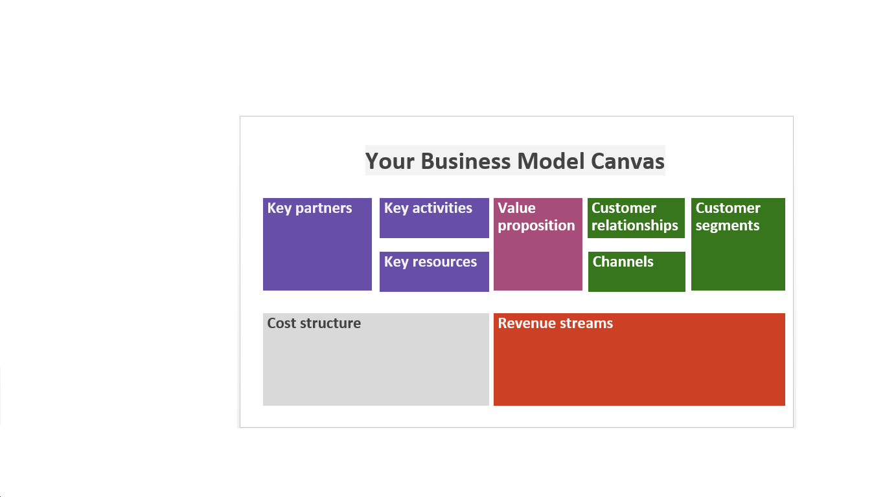

# Build the foundations of your business

<--!-->

## Definition of a company

- A business is an economic unit, legally autonomous, organized to produce goods or services for the market.
- Businesses range in scale from a sole proprietorship to an international corporation. 
- Businesses can be for-profit entities or non-profit organizations that operate to fulfill a charitable mission or further a social cause.
- Video to better understand! 
[https://www.youtube.com/watch?v=p3tyKTAoJtM](https://www.youtube.com/watch?v=p3tyKTAoJtM)

<--!-->

## Startup et lean Startup

- A start-up is a young, innovative company with high development potential, requiring a large investment to finance its rapid growth.
- Lean Startup is an entrepreneurial way, based on iterations : 

1/ launch a minimum bid;

2/ test the market; 

3/ adjust your product;

4/ start again until you find the product-market fit.
- Video to better understand : [https://www.youtube.com/watch?v=bOvo4TA4f5A](https://www.youtube.com/watch?v=bOvo4TA4f5A)

<--!-->

## Let’s have a look at existing companies around you

  - [ ] Company name - how are they known? 
  - [ ] Activity - what do they do? 
  - [ ] Legal status - how were they established? 
  - [ ] Organization- Who does what in the company? 

<--!-->

## The Business Model Canvas

- A bit of history :
  
  Developed by Alexander Osterwalder - a Swiss business theorist, author, speaker, consultant and entrepreneur, known for his work on economic modeling.

- Purpose :

    A Business Model describes exactly how your business will earn money - defining what you are going to sell to which customers, for what purpose, in what way and for what benefit.

- To go further

  A global overview https://www.youtube.com/watch?v=wwShFsSFb-Y
    
    Business Model Canvas Blocks https://www.youtube.com/watch?v=wlKP-BaC0jA

<--!-->

## Business Model / Business Plan

- **Business Model:**
  The logic for creating added value for customers and revenue generation.

- **Business Plan:**
  The operational and financial implementation of this logic.

<--!-->

## Why use the Business Model Canvas?

- The BMC is visual - it allows you to identify your project at a glance. Its structure, consisting of 9 blocks, provides an overview that is lacking when writing a business plan.

- It allows you to move forward with a good overview of the work to be done right now with the available resources (human, financial and time available) and then by iteration towards the most effective business model.

<--!-->

## The Business Model Canvas: instructions for use

- 9 blocks to describe, invent, test and draw a business model.

- Blocks are included in the 4 big dimensions of a company: 

    Customers;

    Offer;   

    Infrastructure;

    Financial Viability.

<--!-->

<--!-->

<--!-->

<--!-->

## 1- Customer segment

- The different groups of people or organizations that your company wants to reach.

- This block can possibly be subdivided between the "customer" who pays for the product or service and the "recipient" who receives the goods or services, but does not necesarily pay the benefit.

<--!-->

## 2- Value proposition

- What pain/need do you answer? What part of your offer creates value for your customers?

- All the products and services that the company will provide that will enable the clients or beneficiaries achieve their own objectives.

<--!-->

## 3- Distribution channels

- How do you reach your customers? How do you communicate with them to create value? 

<--!-->

## 4- Customer relationship

- What is the type of relationship maintained with each customer segment, the way we meet their expectations? 

<--!-->

## 5- Sources of income

- How do you generate turnover?

<--!-->

## 6- Key resources

- What are the most important resources for processes to work properly, whether they be raw materials, human resources, financial resources or your sources of information? 

<--!-->

## 7- Key activities

- What are you doing ? What are the processes, procedures and actions that the company absolutely needs to execute in order for its business model to work.

<--!-->

## 8- Key partners

- How should you structure the network of suppliers and partners vital for the good conduct of the business model?

<--!-->

## 9- Cost structure

- What is expensive? What do you pay mainly? What is the cost allocation?

- All costs generated by the implementation of the described model.

<--!-->

## Your turn!

- Brainstorm
- Fill in your business model canvas
- Discuss the result
- Iterate!

<--!-->

 