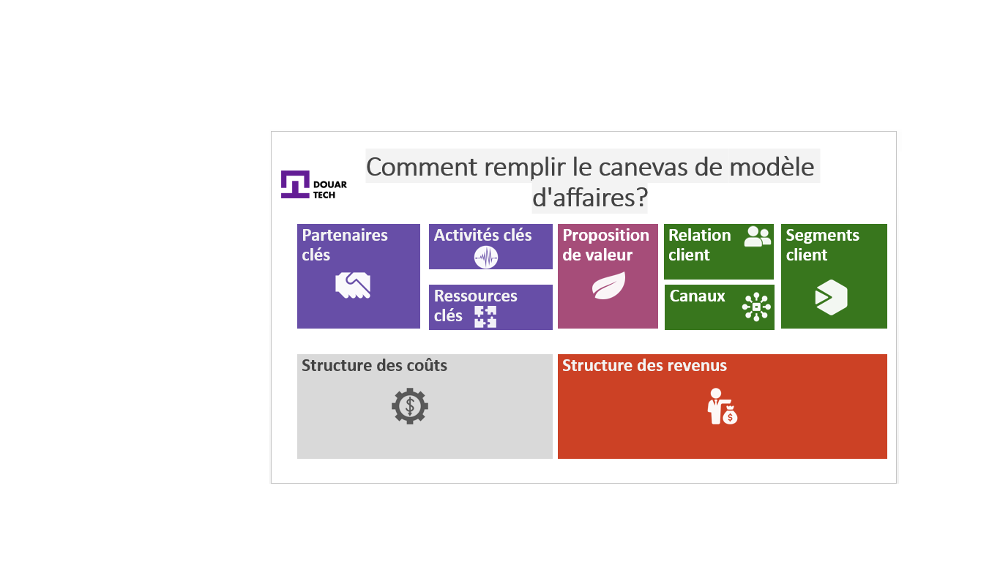
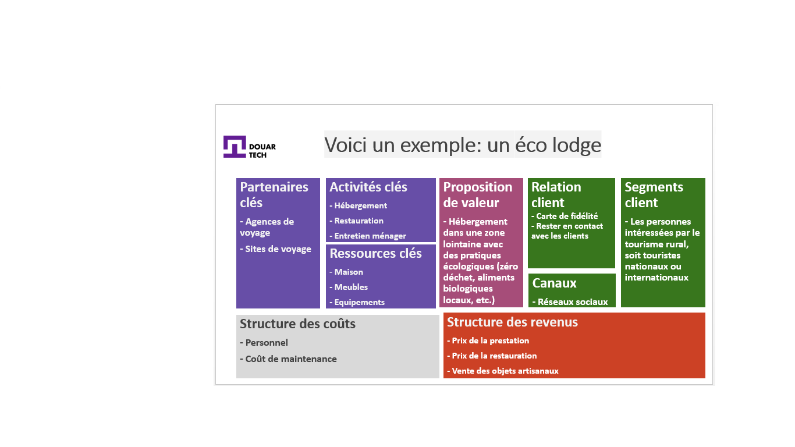
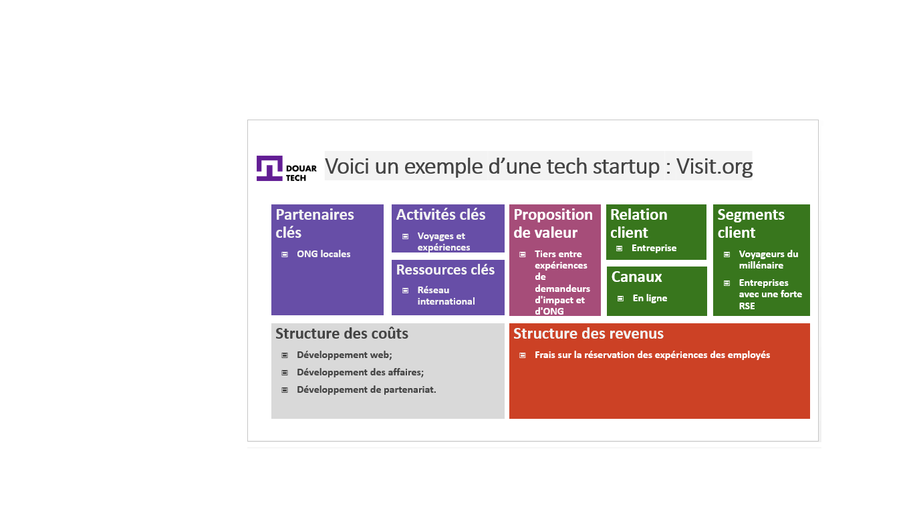
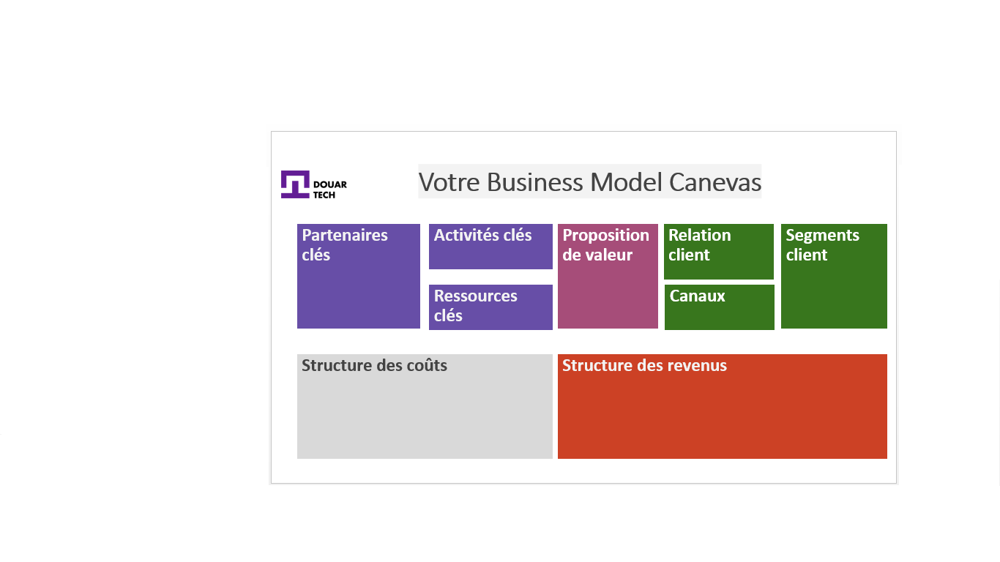

# Construire les fondations de votre entreprise

<--!-->

## Définition d'une entreprise

- Une entreprise est une unité économique,juridiquement autonome,organisée pour produire des biens ou des services pour le marché.
- Les entreprises varient d’une entreprise individuelle à une entreprise internationale.
- Les entreprises peuvent être des entités à but lucratif ou des organisations à but non lucratif qui s'acquittent d'une mission de bienfaisance ou d'une cause sociale.
- Vidéo pour mieux comprendre!
https://www.youtube.com/watch?v=p3tyKTAoJtM

<--!-->

## Startup et lean Startup

- Une **Start up** est une jeune entreprise innovante à fort potentiel de développement,nécessitant un investissement important pour pouvoir financer sa croissance rapide.
- Le Lean Startup est une manière d’entreprendre, basée sur des itérations : 
1/ Lancer une offre minimum;
2/ Tester le marché,
3/ Ajuster son produit; 
4/ Recommencer jusqu’à trouver la meilleure idée à vendre.

  Vidéo : [https://www.youtube.com/watch?v=bOvo4TA4f5A](https://www.youtube.com/watch?v=bOvo4TA4f5A)

<--!-->

## Regardons les entreprises existantes autour de vous

  - [ ] Nom de l'entreprise - comment sont-ils connues?
  - [ ] Activité - que font-ils?
  - [ ] Statut juridique - comment ont-ils été établis?
  - [ ] Organisation - Qui fait quoi dans l'entreprise?

<--!-->

## Business Model Canevas

- Un peu d'histoire :

- Il a été développé par Alexander Osterwalder. Il est théoricien suisse des affaires, auteur, conférencier, consultant et entrepreneur, connu pour ses travaux sur la modélisation économique et le développement du Business Model Canevas.

- Objectif :

- Un modèle économique (ou Business Model en anglais) décrit précisément comment votre entreprise va gagner de l’argent.
En pratique, Cela revient à définir ce que vous allez vendre auprès de quels clients, dans quel but, de quelle manière et pour quel bénéfice.

- Pour aller plus loin :

- Un aperçu global : https://www.youtube.com/watch?v=wwShFsSFb-Y
- Blocs de Business Model Canevas : https://www.youtube.com/watch?v=wlKP-BaC0jA

<--!-->

## Business Model / Business Plan

- **Business Model:**
  La logique permettant la création de valeur ajoutée pour les clients et la génération des revenus.
- **Business Plan:**
  La mise œuvre opérationnelle et financière de cette logique.

<--!-->

## Pourquoi utiliser le Business Model Canvas ?

- Le BMC va vous permettre de cerner votre projet en un coup d’œil. Sa structure, composée de 9 blocs, apporte une vision d’ensemble qui fait défaut quand on rédige un plan d’affaires. 

- Le BMC donne un bon aperçu du travail à accomplir à l’instant même. L’idée est d’avancer avec les ressources (humaines, financières et temps disponible) que vous avez à ce moment. Par itération, vous faites évoluer votre projet en fonction du modèle d’affaires désiré.

<--!-->

## Le Business Model Canevas : mode d’emploi

- 9 blocs pour décrire, inventer, tester et dessiner son modèle économique.

- Ils couvrent les 4 grandes dimensions d’une entreprise : 
    Clients;
    Offre;
    Infrastructure;
    Viabilité financière.

<--!-->

<--!-->

<--!-->

<--!-->

## 1- Segment client

- Les différents groupes de personnes ou organisations que votre entreprise désire atteindre.

- On peut éventuellement subdiviser ce bloc entre le « client » qui paie le produit ou service et le « bénéficiaire », qui reçoit les produits ou services, mais sans payer la prestation.

<--!-->

## 2- Proposition de valeur

- A quel besoin répondez-vous ? Quelle partie de votre offre créée de la valeur pour vos clients ?

- L’ensemble des produits et services que l’entreprise fournira et qui permettra à la clientèle ou aux bénéficiaires de satisfaire leurs besoins et ainsi d’atteindre leurs propres objectifs.

<--!-->

## 3- Canaux de distribution

- Comment atteignez-vous vos clients ? Comment communiquez-vous auprès d’eux pour créer de la valeur ?

<--!-->

## 4- Relation clients 

- Le type de relation entretenue avec chaque segment de clientèle, la manière dont on répond à ses attentes.

<--!-->

## 5- Les sources de revenus 

Comment générez-vous du chiffre d’affaires ?

<--!-->

## 6- Ressources clés

- Quels sont les éléments requis pour le bon fonctionnement de votre service ?

- Les ressources les plus importantes pour que les processus puissent fonctionner correctement, que ce soient des matières premières, des ressources humaines, financières ou encore vos sources d’information.

<--!-->

## 7- Activités clés

- Que faites-vous ?

- Les processus, procédures et actions que l’entreprise doit absolument exécuter pour que son modèle d’affaires puisse fonctionner.

<--!-->

## 8- Partenaires clés

- Quel doit être votre réseau de partenaires et fournisseurs ?

- Le réseau de fournisseurs et partenaires vitaux pour la bonne conduite du modèle d’affaires.

<--!-->

## 9- Structure des coûts :

- Qu’est ce qui vous coûte cher ? Que payez-vous principalement ? Quels sont les principaux coûts et le type de coûts ?

- Ensemble des coûts générés par la mise en place du modèle décrit.

<--!-->

## À votre tour!

- Brainstorm

- Remplissez votre Business Model Canevas

- Discutez du résultat

- Répétez!

<--!-->

