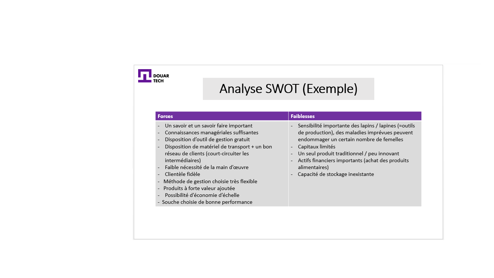
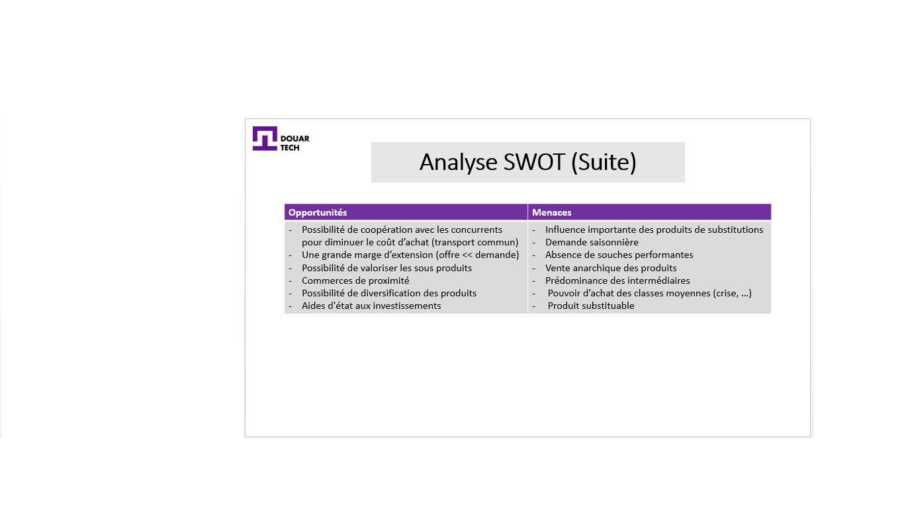
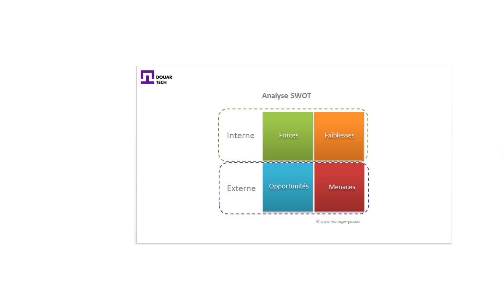

# Concevoir une stratégie

<--!-->

## Analyse SWOT

- Meriem et son mari Ahmed ont décidé tous les deux de créer leur propre projet pour générer du revenu. 

- Ils ont pensé à la création d’une unité de production de lapereaux. Avant de commencer le projet, Meriem et Ahmed ont établi un diagnostic stratégique.

<--!-->

<--!-->

<--!-->

## Réaliser une analyse diagnostic SWOT

- Le SWOT ( Strengths - Weaknesses - Opportunities - Threats ) ou MOFF pour les Francophones (Menaces - Opportunités - Forces - Faiblesses, ) est un outil très pratique lors de la phase de diagnostic stratégique.

- Il présente l'avantage de synthétiser les forces et faiblesses d'une entreprise au regard des opportunités et menaces générées par son environnement.

<--!-->

<--!-->

## Axe interne

- Forces :  ressources possédées et/ou compétences détenues conférant un avantage concurrentiel.

- Faiblesses : manque au regard d'un, voire plusieurs facteurs clés de succès ou bien face aux concurrents.

<--!-->

## Axe externe

- Opportunités : l'environnement de l'entreprise peut présenter certaines zones de potentiel à développer. Il convient de les identifier.

- Menaces : certains changements en cours ou à venir, peuvent avoir un impact négatif sur les activités de l'entreprise.

<--!-->

## Marketing stratégique

- Vidéo explicative : https://www.youtube.com/watch?v=y_g-ZP0hmPY

<--!-->

## Test

- Appliquer une stratégie marketing pour votre projet
