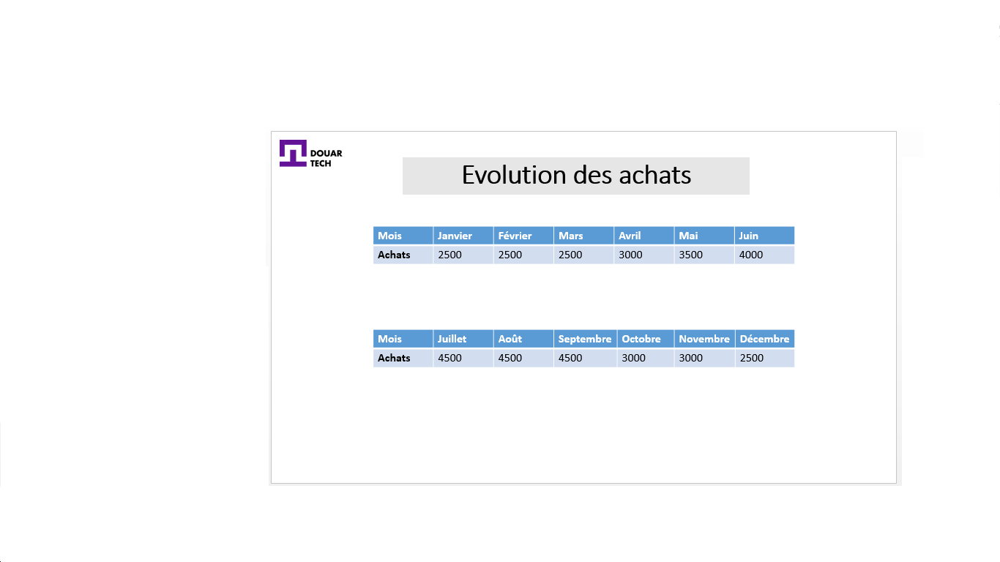

# Gérer les budgets

<--!-->

## Exemple

- Asmaa et Imane veulent se lancer dans la création d’un projet ayant comme activité principale la confection et la vente de caftans et de tenues traditionnelles. 

- Pour ce, elles doivent d’abord trouver un local, acheter les matières premières 
(principalement le tissu) , payer un gérant salarié, payer les différentes charges liées à l’exploitation de leur affaire.

- Etant une entreprise de confection et de commercialisation, Galerie du Caftan doit jouer d’abord sur ses coûts directs variables: Matières premières et Main d’œuvre

<--!-->

## Comment réduire les coûts ?

-  a) Gestion d’approvisionnement : En matière d’approvisionnement, Asmaa et Imane doivent chercher des fournisseurs à moindre coût, et ne pas se contenter d’une connaissance ou d’un fournisseur habituel.

- Les différentes charges: Prix des matières premières 5000 MAD, transport 300 MAD, autres frais d’approvisionnement 100 MAD, loyer de l’entrepôt de stockage 1000 MAD, électricité 250 MAD, salaire de la main d’œuvre 2000 MAD.

- TAF : Calculer les coûts fixes et variables.

<--!-->

<--!-->

## Comment réduire les coûts ?

- b) Optimisation de la gestion des stocks : Asmaa et Imane devront éviter les stocks excédentaires (Des pertes pour l’entreprise) en adoptant la production « juste-à-temps ».

- Asmaa et Imane vont confectionner les caftans en fonction de la demande de leur clientèle, elles opteront ainsi pour du « sur-mesure » et  du « sur-commande » en évitant ainsi le stockage de la marchandise.

<--!-->

## Comment réduire les coûts ?

- c) Utilisation des tableaux de bord (En annexe) : Les associés se devront de mesurer leur situation économique et financière, avec des indicateurs.

- Comme Imane et Asmaa ont prévu certaines performances au cours des 3 premières années de leur entreprise, elles doivent à tout moment savoir où est ce qu’elles en sont dans la réalisation de leur prévisions, aussi elles peuvent comparer les données d’une période à une autre : ainsi, elles peuvent prendre des mesures correctives pour réduire leurs coûts.

- « Le tableau de bord est un outil de mesure des performances de l’entreprise, il est composé d’indicateurs pertinents qui peuvent soit comparer les performances d’une période à une autre, soit comparer ce qui est prévu avec ce qui est réalisé ».

<--!-->

## Gestion prévisionnelle et budgétaire

- Pour la première année de leur activité, Imane et Asmaa ont établi des prévisions de ventes, de production, des approvisionnements…

- Car une gestion budgétaire et prévisionnelle leur permettra de mieux maîtriser les coûts, et de se prémunir contre une gestion non adéquate de leurs ressources.

<--!-->

## Exemple de situation

- Pour l’année 2019, Imane et Asmaa ont prévu ce qui suit: 

- Pour les mois Janvier, Février, Mars, Avril :la demande n’est pas trop importante pour les caftans, à cause de la saisonnalité de l’activité, la demande étant forte pendant l’été (saison des mariages) et pendant Ramadan.

<--!-->

## Exemple de situation

- Du coup, pendant Mai qui coïncide avec Ramadan et pendant les moins de Juin, Juillet, Aout, Septembre l’activité sera plus importante.

- On peut résumer le CA prévisionnel dans le tableau suivant: 

<--!-->

<--!-->

<--!-->

## …Pour piloter la performance de l’entreprise

- La gestion budgétaire avec le tableau de bord constituent tous les deux des outils de contrôle de gestion.

- Ce dernier est permet de piloter la performance de l’entreprise.

<--!-->

<--!-->

## Interprétation du tableau de bord pour le mois de Juin

- Vu la saisonnalité de l’activité, Imane et Asmaa ont prévu un CA (ventes) de 7500 MAD

- Elles estiment un nombre de clients de 60 clients

- Soit un CA par client : 7500/60 = 125 MAD

- Parmi ces 60 clients, 44 sont des clients habituels , et donc 16 sont de nouveaux clients.

<--!-->

- Les familles de produits existantes et le CA prévu par famille de produits sont :
1) Caftans pour femmes : 2500 MAD
2) Tenues pour femmes : 3000 MAD
3) Jellabas pour femmes : 2000 MAD

- La marge commerciale (CA-Coût total) prévue est de : 2600 MAD 

<--!-->

- Les charges fixes prévues : 2500 MAD

- Les charges variables prévues : 2400 MAD

- Le stock en valeur prévu (quantité en stock*prix unitaire) : 1800 MAD

- Le délais de livraison prévu  : dans la journée

<--!-->

- La satisfaction clients prévue: 80 % (selon le feedback des clients habituels)

- Après le mois de juin, les réalisations étaient différentes des prévisions, d’où la constatation des écarts (réel – prévu).

- On se retrouve soit avec des écarts positifs ou négatifs (gain ou perte).
