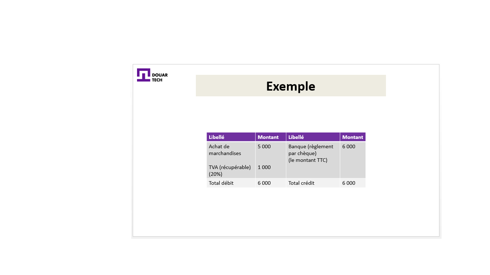

# Tenir une comptabilité simple

<--!-->

## Utilité de la comptabilité

-  Hmida a une épicerie, il achète des marchandises de chez un grossiste dans les environs. Il vend ses produits sans avoir une visibilité sur sa situation économique et financière.

-  Hmida est tellement préoccupé par son cœur de métier qu’il ne prévoit aucune comptabilité pour son affaire.

- Pour avoir de la visibilité par rapport à sa situation économique et financière et savoir ou il va dans son entreprise, un voisin (qui travaille comme consultant) lui a recommandé de tenir une comptabilité générale.

<--!-->

## Comptabilité générale

-  « La comptabilité générale est une obligation légale, un outil d’organisation et de traçabilité au sein de l’entreprise ». 

- Contrairement au régime de comptabilité normal, qui est dédié aux grandes entreprises au-delà d’un certain chiffre d’affaires, le régime simplifié est adapté à la PME respectant certains seuils.

<--!-->

- L’entreprise de Hmida étant une très petite entreprise ne réalisant qu’un petit chiffre d’affaires est soumise au régime du forfait (sur option), c’est un régime simple.

- Elle tient un livre journal des dépenses et des recettes avec conservation des documents (Exemple de document: factures reçues de son grossiste).

- Autrement dit, elle gère une comptabilité de caisse.

<--!-->

<--!-->

## La facture : pièce justificative

- Il est à rappeler que la base de ses écritures comptables est la facture. La facture est la pièce justificative de toute écriture comptable.

- La facture contient entre autres les mentions suivantes :
-Informations sur l’acheteur et le vendeur, 
-le prix du produit ,
-la quantité vendue, 
-le montant hors taxe, 
-le montant TTC (toutes taxes comprises, les réductions éventuellement…)

<--!-->

## Facture « doit » / facture « avoir »

- Il faut faire la distinction entre la facture « doit » et la facture « avoir ».

- La facture « doit » est la facture qui mentionne le montant que le client doit au fournisseur, après une transaction commerciale.

- Comme le grossiste a une grande entreprise, dont le Chiffre d’affaires dépasse un certain seuil (déterminé par la loi comptable), il est tenu d’appliquer une comptabilité générale selon le régime net réel (le plus répandu).

<--!-->

## Exemple de facture « doit »

- Le grossiste (le fournisseur)  a adressé à l’entreprise de Hmida la facture N° 1030, le 08/05/2019

Marchandises 6 000 HT
TVA 20%
Remise 5%
Le règlement est effectué en espèces 

<--!-->

## Etablissement de la facture 1030

(1) Marchandises  	6 000 
(2) Remise 5%        	   300
(3) Net commercial	5700  (1) – (2) 
(4) TVA (20%)            1140  (3) * 0,2
Net à payer                6840   (3) + (4)

<--!-->

## La facture « Avoir »

- Dans le cas où le client retourne au fournisseur une partie de la marchandise (ou son ensemble), pour cause de non-conformité, le fournisseur doit adresser à son client une nouvelle facture appelée « Avoir ».

- Telle est la différence entre les deux factures, « doit » et « avoir ».

<--!-->

## Principe de la partie double

- Alors que le grossiste qui adopte le régime de droit commun (régime du bénéfice net réel), enregistre sa facture selon les principes de la comptabilité générale, avec notamment le principe de la partie double.

- La partie double : chaque écriture enregistrée dans la colonne « débit » a sa contrepartie (une ou plusieurs écritures) du même montant dans la colonne « crédit ».

<--!-->

<--!-->

## Régime forfaitaire

- L’entreprise de Hmida, quant à elle, enregistre l’écriture différemment (en étant soumise au régime forfaitaire= recettes et dépenses).

- L’achat de la marchandise représente une dépense pour cette entreprise.

- Alors, Hmida l’enregistrera simplement dans sa colonne « dépenses ».