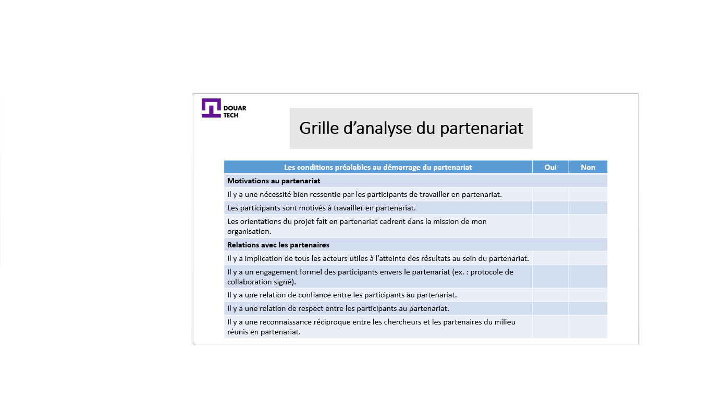
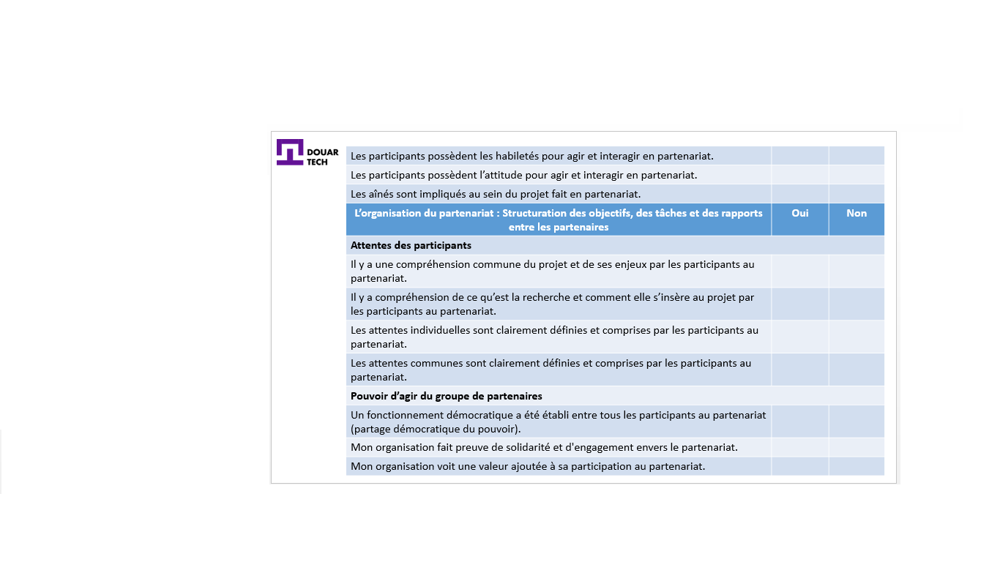
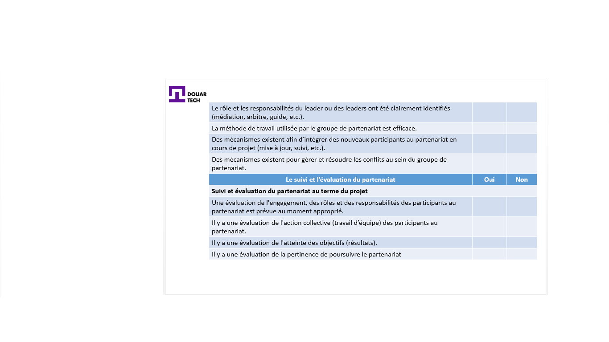

# Chercher des partenaires et collaborer

<--!-->

## Qu’est ce qu’un bon partenariat ? 

- Une relation constructive dans la durée

- Principes et valeurs communes

<--!-->

## Exemple d’un partenariat réussi : Targanine

- Placé au cœur d’Agadir, la capitale du Souss, le Groupement d’Intérêt Economique (GIE Targanine) regroupe 6 coopératives féminines de production d’huile d’argane.

- Vidéo : https://www.youtube.com/watch?v=jpJ4x0lSxgw

<--!-->

## Sélection d’un partenaire 

- Lors du processus de sélection d’un partenaire d’affaires, voici quelques grands principes de base à respecter :

-Expérience du partenaire envisagé (notamment celle des dirigeants) 
-Expertise et connaissances du partenaire 
-Notoriété et crédibilité 
-Vision du partenaire 
-Lignes d’affaires vs le secteur de l’entreprise (complémentarité, synergie, conflit)  
-Clientèle
-Infrastructures d’opération (systèmes, processus d’affaires, outils, équipements…) 

<--!-->

<--!-->

<--!-->

<--!-->

<--!-->

## Test

- Mentionner les critères les plus importants qui peuvent vous mener à élaborer un partenariat avec une autre partie.
