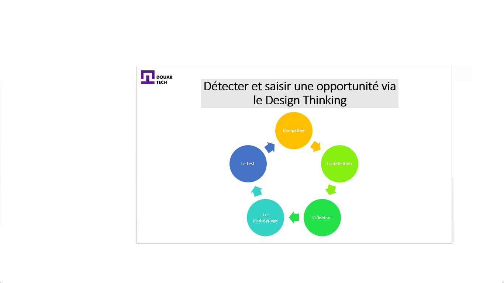

# Explorer des idées de projets à partir des problèmes rencontrés par la communauté

<--!-->

<--!-->

## 1ère phase : L’empathie

- Il est utile de commencer par faire des recherches sur le sujet, pour mieux comprendre la sphère de l’usager. 

- Puis on procède à l’observation, par exemple on peut demander d’expliquer la tâche qu’il effectue, le but étant à ce stade d’être à l’écoute pour mieux comprendre et surtout ne pas interférer.

- Faire des entretiens se révèle être une source importante d’informations pour l’analyse des usages.

<--!-->

## 2ème phase : La définition

- Les problèmes exprimés lors de la phase précédente doivent désormais être formulés dans une problématique. 

- Il est conseillé de classer les informations pour mieux appréhender toutes les questions qui en découleront. 

<--!-->

## 3ème phase : L’idéation 

- Le brainstorming avec une équipe composée de personnes d’horizons différents (ingénierie, marketing, stagiaire, etc) est la meilleure méthode pour générer des idées. 

- Le but n’est pas de se mettre tous d’accord sur une solution tout de suite (ce qui est statistiquement peu probable !), mais d’en fournir le maximum pour ensuite en garder les meilleures.

<--!-->

## 4ème phase : Le prototypage

- En fonction du projet, le premier prototype peut prendre plusieurs formes (dessin, maquette, plan, schéma) mais ce qui est commun à tous, c’est la simplicité. 

- C’est grâce aux tests utilisateurs que l’on va pourvoir faire évoluer le prototype.

<--!-->

## 5ème phase : Le test

- Dans cette dernière phase, on doit s’ouvrir à nouveau et proposer notre concept à un groupe de testeurs. 

- Leurs feedbacks sont précieux pour faire évoluer le concept et mieux répondre à leurs besoins, qui sont sensiblement les mêmes que ceux des futurs utilisateurs. 

- Il ne faut pas interférer sur l’usage qu’ils vont faire de votre maquette pendant cette phase de test.

<--!-->

## Test Card pour valider son idée de projet

- Lien de la carte : https://assets.strategyzer.com/assets/resources/the-test-card.pdf

- Vidéo explicative :  https://www.youtube.com/watch?v=cW46ySJmLD8

<--!-->

## Test

- Elaborer votre propre « Test Card » 

