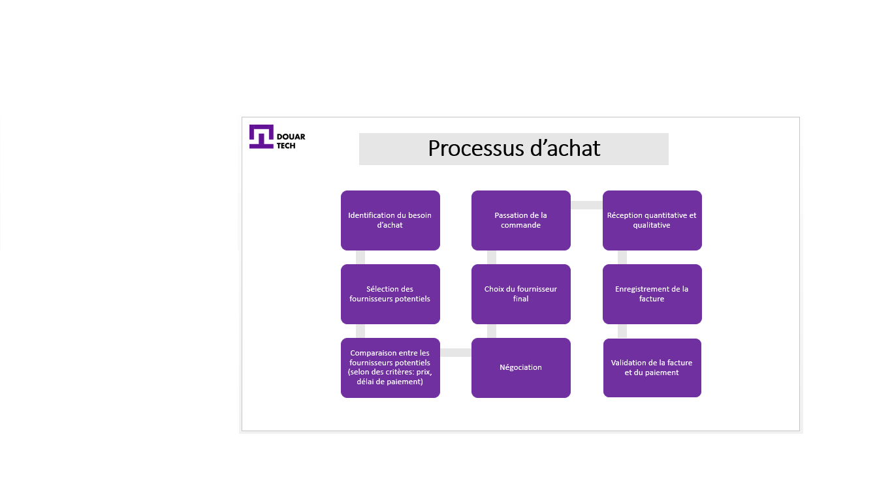
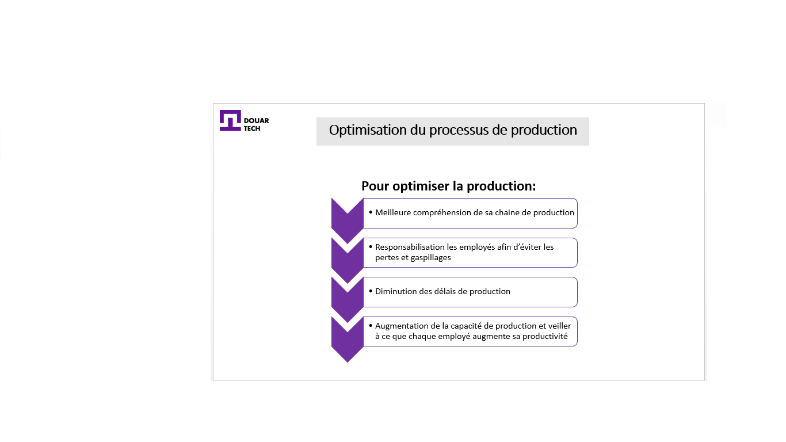

# إدارة العمليات

<--!-->

## مثال

- قرر لحسن و 4 من أصدقائه توحيد القوى لإنشاء تعاونية ، فهم يعيشون في منطقة ريفية في سوس بالقرب من أغادير ، نظرًا لمناخ هذه المنطقة وثروتها بأشجار الأرغان واللوز

-  مشروعهم يتمحور على تصنيع وتسويق المنتجات المحلية ، وهي أساسا زيت أركان وأملو

- في البداية ، سيبيع لحسن وأصدقاؤه منتجاتهم للعملاء المحليين فقط ، ثم ، شيئًا فشيئًا ، سيقومون بتوسيع أعمالهم وتصديرها إلى الخارج ، خاصة وأن هذه المنتجات تتمتع بشعبية غير مسبوقة.

<--!-->

## تسيير المشروع

-  لتنفيذ المشروع، يجب توفير الأدوات والأساليب المناسبة التي ستسمح بإنجاز المهام بطريقة فعالة وتتسم بالكفاءة ، وهذا ما يسمى إدارة المشروع

- تغطي إدارة المشروع جميع الأدوات والتقنيات والأساليب التي تسمح لك بإجراء وتنسيق ومواءمة المهام المختلفة المنفذة في إطار المشروع ، بحيث تلبي الاحتياجات الصريحة والضمنية

<--!-->

## أهداف إدارة المشروع

1) توقع
2) التواصل والتنسيق
3) إدارة التكاليف / المواعيد النهائية / العروض

<--!-->

## 1) توقع

- في المثال الذي بين أيدينا، لحسن وأصدقاؤه غير متأكدين من نجاح مشروعهم ، بسبب المنافسة القوية التي يعاني منها هذا النوع من المنتجات (المخاطر الخارجية) ولكن أيضًا فيما يتعلق بجودة المواد الخام التي يمكن أن تكون ضعيفة (المخاطر الداخلية)

<--!-->

## كيف تتوقع المخاطر؟

- تحديد المخاطر (الداخلية والخارجية)
- تحليل هذه المخاطر
-  المعالجة

<--!-->

## مثال

- يتم تحديد المخاطر على النحو التالي: منافسة قوية

- تحليل المخاطر: هذه المنافسة القوية ترجع إلى وفرة زيت الأرغان ومنتجات أملو في السوق ؛ يمكن أن تكون المنتجات متشابهة من حيث الجودة وبأسعار أكثر تنافسية

- لمعالجة هذا الخطر ، عليك التفكير في الابتكار لأن المنتجات في السوق متساوية ، وكلها كلاسيكية ، لذلك بعد تفكير طويل اتضح أنه سيكون من الضروري إنشاء هوية مرئية جديدة ، و تغليف جديد للمنتج

<--!-->

## 2) التواصل والتنسيق

- سيتم انتخاب رئيس التعاونية لحسن كمدير مشروع لهذه الأخيرة. سيضمن التنسيق بين الأطراف المختلفة لضمان الاستخدام الأمثل للموارد لتحقيق الأهداف المحددة

- سيكون المحاور المتميز لأعضاء الفريق من خلال اعتماد اتصال فعال (يجب أن يكون المتواصل الجيد حازمًا ومقنعًا ومتعاطفًا ودبلوماسيًا ويعرف كيفية إدارة الصراعات بين أعضاء التعاونية)

<--!-->

## مثال 

- لتنفيذ مشروع تجديد المنتجات ، فإن لحسن بصفته مدير المشروع ، سيضمن التنسيق الجيد بين الأطراف الفاعلة، بالإضافة إلى التواصل الفعال

- أولاً ، يجب عليه تنظيم جلسات عصف ذهني حول المشروع الجديد ، ويجب عليه استشارة آراء الأعضاء المختلفين ، وموازنة الإيجابيات والسلبيات ، والتعامل مع الاعتراضات بحزم ، مع إظهار التعاطف وأخيرًا اختيار بالإجماع للحل

- خارجياً ، يجب عليه الإعلان عن المنتج من خلال تسليط الضوء على جانبه المبتكر

<--!-->

## 3) إدارة التكاليف / المواعيد النهائية / العروض

- Evidemment, et comme pour chaque entreprise,  Il y a des écarts entre le prévu et le réalisé. Lahcen doit suivre ces données et proposer des solutions en cas d’écart. 

- Ses critères de décision sont les objectifs du projet, autrement dit, le niveau de qualité ou performance visé. Il peut par exemple jouer sur les délais au détriment de la qualité.

<--!-->

## مثال

- فيما يتعلق بالتكاليف، سيهتم لحسن بالحفاظ على سعر تكلفة يتماشى مع أسعار المنافسين (بحيث لا يرتفع سعر البيع وبالتالي يكون أقل تنافسية)

- أيضا، يجب أن يحافظ لحسن على نفس جودة المنتجات. أما بالنسبة للموعد النهائي المحدد مع المورد ، فسيقوم بالتفاوض على المواعيد النهائية المعقولة حتى لا يكون هناك نفاد في المخزون ، ويكون المنتج متاحًا دائمًا

<--!-->

<--!-->

## عملية الإنتاج والتسويق

- في حالة هذه التعاونية ، فإن المواد الخام  هي بذور الأرغان واللوز ، بعد اختيارهم ، تشتري التعاونية هذه المنتجات التي تخزنها جزئيًا في المحل ، ويتم استخدام الجزء الآخر للتصنيع

- تعمل الورشة الأولى على صنع زيت الأرغان يدويًا بينما تصنع الورشة الثانية أملو من زيت الأرغان واللوز ، ثم يتم تعبئة هذه المنتجات قبل تخزينها وبعضها مخصص للتسويق حسب طلب السوق.

<--!-->

<--!-->

## مثال

- تحديد الحاجة إلى الشراء: لتصنيع زيت الأرغان داخل التعاونية ، من الواضح أنه من الضروري شراء بذور الأرغان من مزارع

- اختيار الموردين المحتملين: المنطقة غنية بأشجار الأرغان ، والعديد من المزارعين في المنطقة يجعلون بيع بذورها نشاطًا لهم، لذا فإن لحسن لديه خيارات متعددة لاختيار الموردين المحتملين. اختار في البداية ، خمسة مزارعين لقربهم

- مقارنة بين الموردين المحتملين: يتصفح هؤلاء المزارعين الخمسة ويطلب منهم السعر وإمكانية منحه خصمًا وتسهيلات للدفع

<--!-->

- التفاوض: تفاوض معهم ، وتبين بعد ذلك أن اثنين من هؤلاء المزارعين الخمسة هم الأقل سعراً وفي نفس الوقت لديهم جودة جيدة فيما يخص البذور 

اختيار المورد النهائي: من بين المتأهلين، أحدهم (مصطفى) مستعد لمنح خصم كبير في حالة الشراء بالجملة سيمنح لحسن إمكانية الدفع بأقساط  على مدى 6 أشهر. لذلك وقع الاختيار منطقياً على مصطفى

تقديم الطلب: لذلك قام لحسن بتقديم الطلبية لمصطفى وتلقى في المقابل "نموذج طلب" كدليل على العملية التي تم إجراؤها (بما في ذلك ، على وجه الخصوص ، الكمية المشتراة وسعر البيع والمبلغ الذي سيتم دفعه بعد تطبيق التخفيض التجاري)

<--!-->

- الاستلام الكمي والنوعي: عند تقديم الطلب ، اتفق الطرفان على تاريخ استلام البضائع ، لذلك احترم مصطفى المورد، التاريخ المحدد ونقل مجموعة المنتجات إلى لحسن (يتم زيادة سعر النقل على سعر البيع) ، تلقى لحسن البضائع وأجرى فحصًا كميًا (عدد الكيلوغرامات المطلوبة) ونوعيًا (جودة المنتج المختار)

- تسجيل الفاتورة: يبدأ قسم المحاسبة بعد ذلك في تسجيل فاتورة الشراء عن طريق التحقق من صحة المعلومات الموضحة أعلاه ومقارنة اتفاقها مع نموذج الطلب ، يتم تسجيل فاتورة الشراء في دفتر الشراء، ثم يتم نقلها إلى الكتاب الجامع.

- المصادقة على الفاتورة والدفع: بعد التحقق من صحة الفاتورة والسجل المحاسباتي ، سيدفع لحسن إلى المورد، حيث اتفقا على أقساط الدفع على مدى 6 أشهر، سوف يدفع الدفعة الأولى، أما الخمسة الأشطار المتبقية سيدفعها على شكل شيكات بتاريخ نهاية كل شهر

<--!-->

<--!-->

## اختبار

- ماذا عن عمليات الشراء والإنتاج والتسويق الخاصة بمشروعك ؟

- لخص كل عملية في 3 خطوات رئيسية على شكل رسوم بيانية

