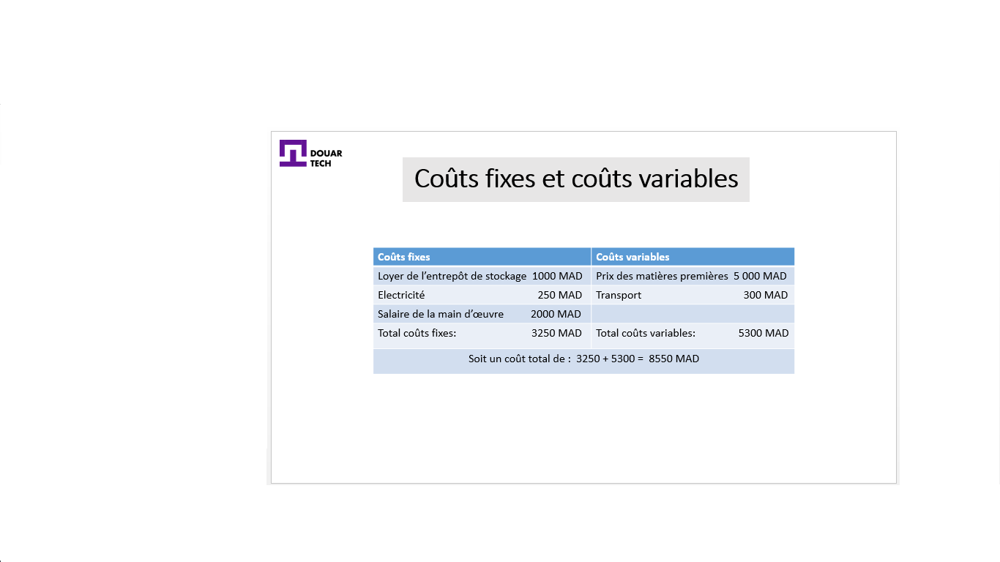
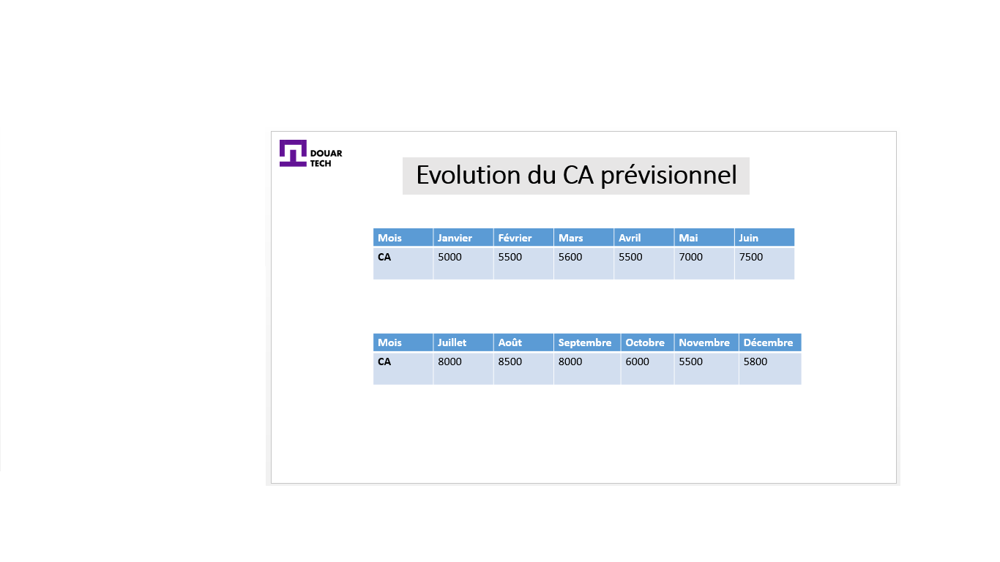
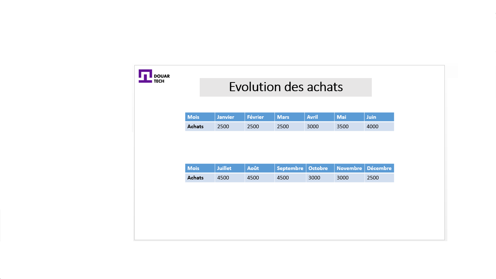
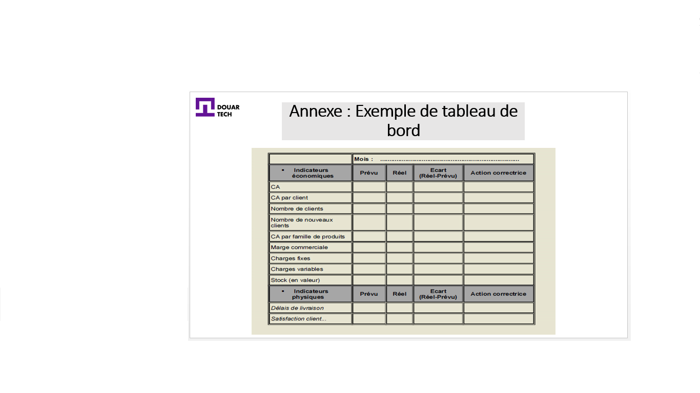

# إدارة الميزانيات

<--!-->

## مثال

- ترغب أسماء وإيمان في الشروع في إنشاء مشروع يتمثل نشاطه الرئيسي في صنع وبيع القفطان والأزياء التقليدية

- لهذا ، يجب عليهما أولاً العثور على محل، شراء المواد الخام (النسيج بشكل أساسي) ، دفع راتب المسير، ودفع الرسوم المختلفة المتعلقة بالتشغيل

- لكونها مقاولة خاصة بالخياطة و التسويق، فيجب أن تركز على تكاليفها المباشرة المتغيرة : المواد الخام و اليد العاملة

<--!-->

## كيفية خفض التكاليف؟

-  a) إدارة التوريد: فيما يتعلق بالتوريد ، يجب على أسماء وإيمان البحث عن موردين بتكلفة منخفضة ، وعدم الاكتفاء بأحد المعارف أو المورد المعتاد

- الرسوم المختلفة: سعر المواد الخام 5000 درهم ، النقل 300 درهم ، تكاليف التوريد الأخرى 100 درهم ، إيجار المستودع 1000 درهم ، الكهرباء 250 درهم ، أجر اليد العاملة 2000 درهم

- عمل للإنجاز : حساب التكاليف الثابتة والمتغيرة

<--!-->

<--!-->

## كيفية خفض التكاليف؟

- ب) تحسين إدارة المخزون: سيتعين على أسماء وإيمان تجنب المخزونات الزائدة (الخسائر للشركة) من خلال اعتماد الإنتاج "في الوقت المناسب"

- ستقوم أسماء وإيمان بصنع القفاطين حسب طلب عملائهم ، وبالتالي سيكون العمل "حسب المقاس" و "عند الطلب" وبالتالي تجنب تخزين البضائع

<--!-->

## كيفية خفض التكاليف؟

- استخدام لوحات العدادات (في الملحق): سيتعين على الشركاء قياس وضعهم الاقتصادي والمالي ، باستخدام المؤشرات

- نظرًا لأن إيمان وأسماء قد خططا لأداء معين خلال السنوات الثلاث الأولى من عملهما ، يجب معرفة مدى تقدمهما في تحقيق التوقعات، حتى يتمكنا من مقارنة البيانات بين الفينة و الأخرى : وبالتالي ، سيمكن اتخاذ تدابير تصحيحية لخفض التكاليف

- "لوحة القيادة هي أداة لقياس أداء الشركة ، وتتكون من مؤشرات تمكن من مقارنة الأداء بين الفينة و الأخرى، أو مقارنة ما هو مخطط بما تم تحقيقه"

<--!-->

## إدارة التوقعات والميزانية

- في السنة الأولى من نشاطهما، أجرت إيمان وأسماء توقعات للمبيعات، للإنتاج، للتوريد وما إلى ذلك

- لأن تدبير الميزانية والتنبؤات سيسمح لهما بالتحكم في التكاليف بشكل أفضل، وحماية أنفسهما من التدبير غير الملائم للموارد

<--!-->

## مثال

- لعام 2019 ، خططت إيمان وأسماء لما يلي

- بالنسبة لأشهر يناير وفبراير ومارس وأبريل: الطلب ليس كبيرًا جدًا على القفاطين ، بسبب موسمية النشاط ، حيث كان الطلب قويًا خلال الصيف (موسم الزفاف) وخلال شهر رمضان

<--!-->

## مثال

- ونتيجة لذلك ، خلال شهر ماي الذي يتزامن مع شهر رمضان وخلال أشهر يونيو ويوليوز وأغسطس وسبتمبر ، سيكون النشاط أكثر رواجا

- يمكننا تلخيص حجم التداول في الجدول التالي

<--!-->

<--!-->

<--!-->

## لتوجيه أداء الشركة

- تدبير الميزانية و لوحة التحكم، يشكلان أداة من أدوات الرقابة الإدارية

- يستخدم هذا الأخير لمراقبة أداء الشركة

<--!-->

<--!-->

## تفسير لوحة العدادات لشهر يونيو

- بالنظر إلى موسمية النشاط ، توقعت إيمان وأسماء مبيعات ب7500 درهم

- يقدرون عدد العملاء ب60 عميلا

- أي دوران لكل عميل: 7500/60 = 125 درهم مغربي

- من بين هؤلاء العملاء الـ 60 ، هناك 44 عميلًا مكررًا ، وبالتالي 16 عميلًا جديدًا

<--!-->

- عائلات المنتجات الحالية والدوران المتوقع حسب عائلة المنتجات هي
1) قفاطين للسيدات: 2500 درهم
2) أزياء للنساء : 3000 درهم
3) جلابات نسائية: 2000 درهم

- الهامش التجاري (رقم الأعمال - التكلفة الإجمالية) المتوقع: 2600 درهم 

<--!-->

- التكاليف الثابتة المتوقعة: 2500 درهم

- التكاليف المتغيرة المتوقعة: 2400 درهم

- القيمة المتوقعة للمخزون (الكمية في المخزون * سعر الوحدة): 1800 درهم

- وقت التسليم المتوقع: خلال اليوم

<--!-->

- رضا العملاء المتوقع: 80٪ (بناءً على ملاحظات العملاء المعتادين)

- بعد شهر يونيو ، كانت الإنجازات مختلفة عن التوقعات ، وبالتالي تم العثور على الفجوات (الحقيقية - المتوقعة)

- نجد إما فوارق إيجابية أو سلبية (الربح أو الخسارة)
