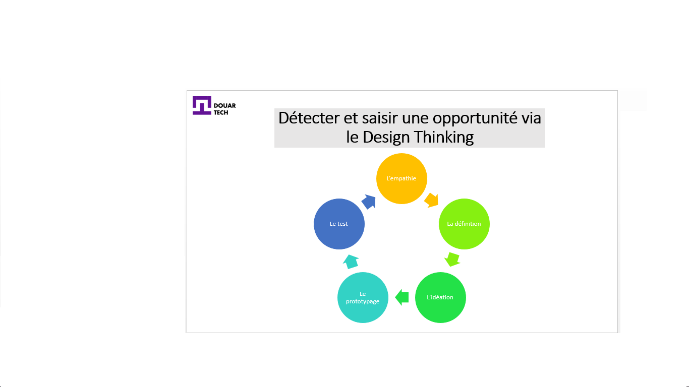

# استكشف أفكار مشاريع بناءً على المشكلات التي واجهها المجتمع

<--!-->

<--!-->

## المرحلة الأولى: التعاطف

- من المفيد البدء بالبحث عن الموضوع ، لفهم مجال المستخدم بشكل أفضل

- ثم ننتقل إلى الملاحظة ، على سبيل المثال ، يمكننا أن نطلب من المستخدم شرح المهمة التي يؤديها ، والهدف في هذه المرحلة هو الاستماع من أجل فهم أفضل وخصوصا عدم التدخل

- إجراء مقابلات يعتبر مصدر مهم للمعلومات من أجل تحليل الاستخدامات 

<--!-->

## المرحلة الثانية: التحديد

- المشاكل التي تم التعبير عنها خلال المرحلة السابقة يجب أن تصاغ الآن عن طريق إشكالية 

- من المستحسن تصنيف المعلومات لفهم جميع الأسئلة التي قد تنشأ عنها بشكل أفضل

<--!-->

## المرحلة الثالثة: التفكير

- العصف الذهني مع فريق من الناس من خلفيات مختلفة (الهندسة ، التسويق ، المتدرب ، إلخ) هو أفضل طريقة لتوليد الأفكار

- الهدف ليس الاتفاق على حل على الفور (وهو أمر غير مرجح إحصائيًا!) ، ولكن توفير الحد الأقصى من الحلول ثم الاحتفاظ بالأفضل

<--!-->

## المرحلة الرابعة: النموذج الأولي

- اعتمادًا على المشروع ، يمكن أن يتخذ النموذج الأولي عدة أشكال (الرسم ، النموذج ، الخطة ، الرسم التخطيطي) ، ولكن ما هو مشترك بين الجميع هو البساطة

- بفضل اختبارات المستخدم سنكون قادرين على تطوير النموذج الأولي

<--!-->

## المرحلة الخامسة: الاختبار

- في هذه المرحلة الأخيرة ، علينا الانفتاح مرة أخرى وتقديم مفهومنا لمجموعة من المختبرين

- تعليقاتهم لا تقدر بثمن في المساعدة على تطوير المفهوم وتلبية احتياجاتهم بشكل أفضل ، والتي تعتبر تقريبًا مثل احتياجات المستخدمين في المستقبل 

- يجب ألا تتدخل في الاستخدام الذي سيجرى على نموذجك خلال مرحلة الاختبار 

<--!-->

## بطاقة اختبار للتحقق من صحة فكرة مشروعك

- رابط البطاقة : https://assets.strategyzer.com/assets/resources/the-test-card.pdf

- فيديو توضيحي :  https://www.youtube.com/watch?v=cW46ySJmLD8

<--!-->

## اختبار

- تطوير "بطاقة الاختبار" الخاصة بك

