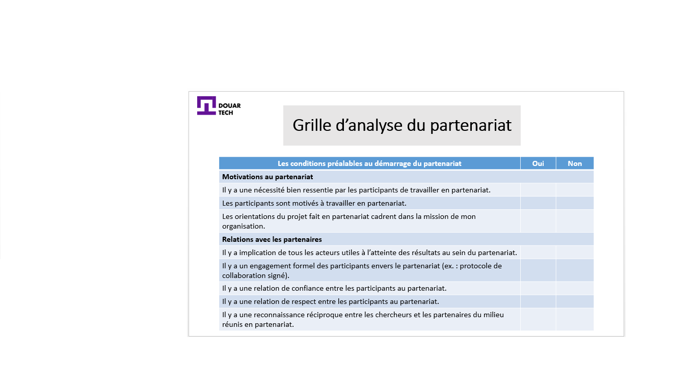
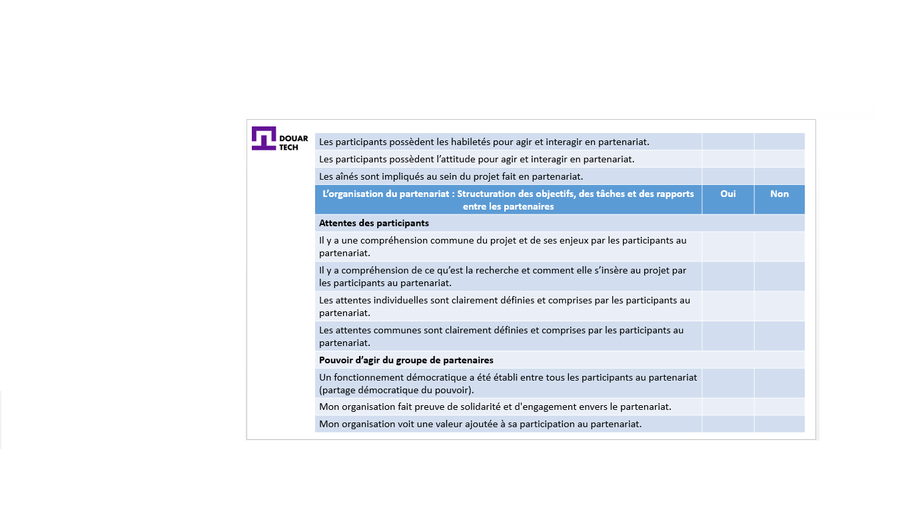
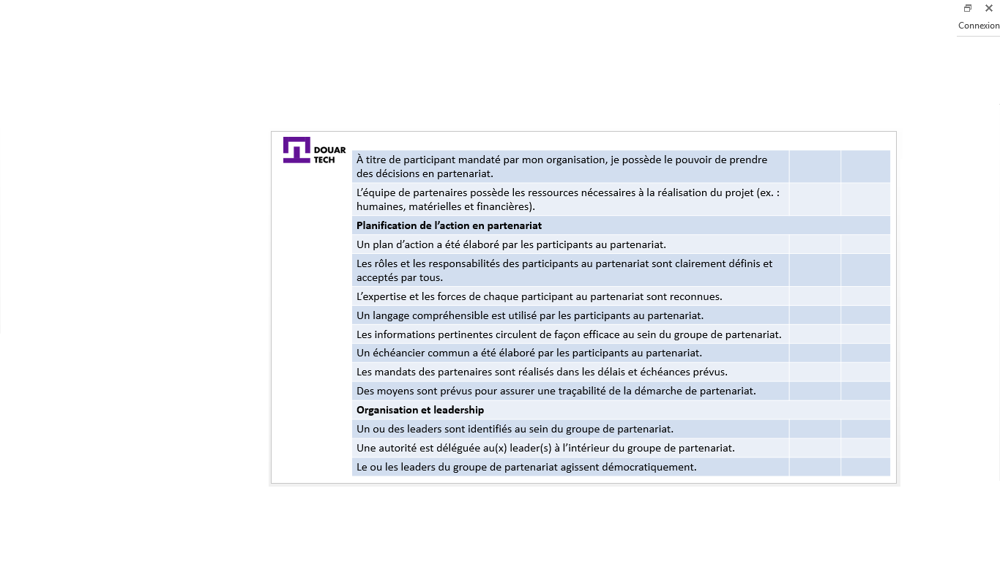

# البحث عن شركاء والتعاون

<--!-->

## ما هي الشراكة الجيدة؟ 

- علاقة بناءة طويلة الأمد

- المبادئ والقيم المشتركة

<--!-->

## مثال على الشراكة الناجحة: تارغانين

- مثال على الشراكة الناجحة: تجمع مجموعة المصالح الاقتصادية (تارغانين) التي تقع في قلب مدينة أغادير ، عاصمة سوس ، 6 تعاونيات نسائية لإنتاج زيت الأرغان

- فيديو : https://www.youtube.com/watch?v=jpJ4x0lSxgw

<--!-->

## اختيار شريك 

- عند اختيار شريك عمل، إليك بعض المبادئ الأساسية التي يجب اتباعها:

- خبرة الشريك المتوخى (لا سيما خبرة المديرين)
- خبرة ومعرفة الشريك
- الوعي والمصداقية
- رؤية الشريك
- خطوط الأعمال مقابل قطاع الأعمال (التكامل والتآزر والصراع)
- الزبائن
- البنى التحتية التشغيلية (الأنظمة والعمليات التجارية والأدوات والمعدات ...)

<--!-->

<--!-->

<--!-->

<--!-->

<--!-->

## اختبار

- اذكر أهم المعايير التي يمكن أن تقودك إلى تطوير شراكة مع طرف آخر
