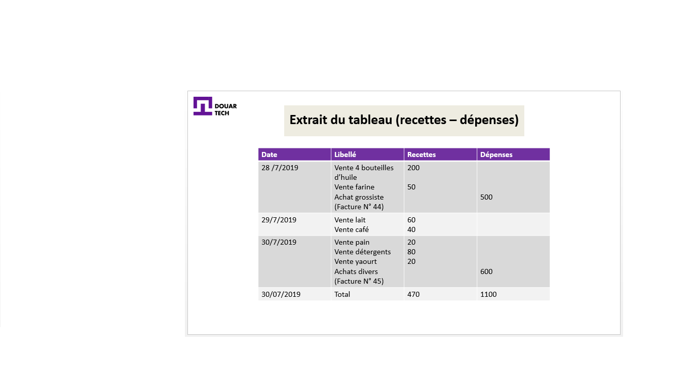
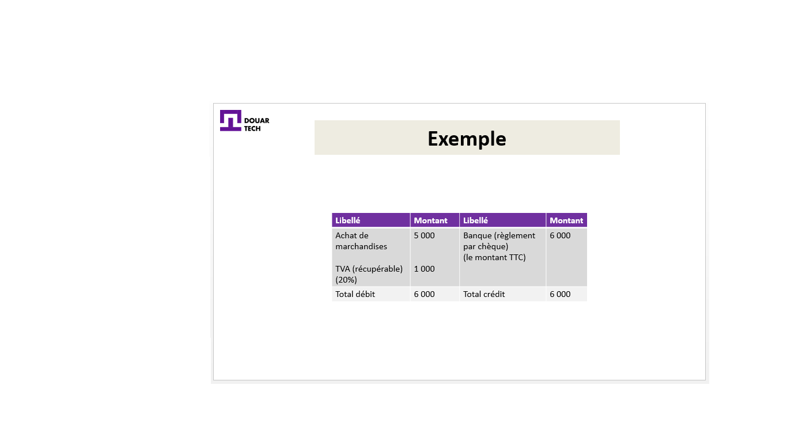

# القيام بمحاسبة بسيطة

<--!-->

## فائدة المحاسبة

-  يمتلك احميدة متجر بقالة ، و يشتري البضائع من تاجر جملة قريب. لكن احميدة يبيع منتجاته دون أن يكون على دراية بوضعه الاقتصادي والمالي

-  يشعر احميدة بقلق شديد حيال عمله الأساسي لدرجة أنه لا يخطط لأي محاسبة لمقاولته

- لمعرفة وضعه الاقتصادي والمالي، أوصىاه جار له (يعمل كمستشار) أن يقوم بالمحسابة العامة

<--!-->

## المحاسبة العامة

-  "المحاسبة العامة هي التزام قانوني ، وأداة للتنظيم والتتبع داخل الشركة"

- على عكس النظام المحاسباتي العادي ، المخصص للشركات الكبيرة التي تتجاوز معدل دوران معين ، فإن النظام المبسط مناسب للشركات الصغيرة والمتوسطة التي لا تتجاوز عتبات معينة

<--!-->

- 
كون مقاولة احميدة مقاولة صغيرة للغاية مع دوران صغير فقط فإنها تخضع لنظام المعدل الثابث (اختياري) ، و الذي هو نظام بسيط

- تقم بمجلد للنفقات و الإيرادات مع الاحتفاظ بالوثائق (مثال على المستند: الفواتير المستلمة من تاجر الجملة)

- بمعنى آخر ، تدير المحاسبة النقدية

<--!-->

<--!-->

## الفاتورة: مستند داعم

- يجب أن نتذكر أن أساس الكتابات المحاسباتية هو الفاتورة. الفاتورة هي المستند الداعم لجميع الكتابات المحاسباتية

- تحتوي الفاتورة على المعلومات التالية:
-معلومات عن المشتري والبائع ،
-سعر المنتج ،
- الكمية المباعة ،
-المبلغ باستثناء الضرائب ،
- المبلغ شاملاً جميع الضرائب (شامل جميع الضرائب ، التخفيضات إذا لزم الأمر ...)

<--!-->

## الفاتورة "doit" / الفاتورة "avoir"

- يجب التمييز بين الفاتورتين

- الفاتورة "doit" هي الفاتورة التي تشير إلى المبلغ الذي يدين به العميل للمورد بعد المعاملة التجارية

- نظرًا لأن تاجر الجملة لديه شركة كبيرة ، يتجاوز حجم مبيعاتها حدًا معينًا (يحدده قانون المحاسبة) ، فإنه مطالب بتطبيق المحاسبة العامة وفقًا لنظام صافي حقيقي (الأكثر شيوعًا)

<--!-->

## مثال على الفاتورة "doit"

- أرسل تاجر الجملة (المورد) فاتورة لمقاولة احميدة رقم 1030 بتاريخ 08/05/2019

السلع 6000 باستثناء الضرائب
20٪ ضريبة القيمة المضافة
خصم 5٪
يتم الدفع نقدا

<--!-->

## تحرير الفاتورة 1030

(1) السلع 6000
(2) خصم 5٪ = 300
(3) صافي تجاري= 5700 (1) - (2) 
(4) ضريبة القيمة المضافة (20٪) = 1140 (3) * 0.2
صافي الدفع = 6840 (3) + (4)

<--!-->

## فاتورة الائتمان "avoir"

- في حالة قيام العميل بإعادة جزء من البضائع (أو جميعها) إلى المورد ، بسبب مشكلة ما ، يجب على المورد إرسال فاتورة جديدة إلى العميل تسمى فاتورة الإتمان

- هذا هو الفرق بين الفاتورتين "doit" و "avoir"

<--!-->

## مبدأ الجزء المزدوج

- تاجر الجملة الذي يتبنى نظام القانون العام (نظام صافي الربح الحقيقي) ، يسجل فاتورته وفقًا لمبادئ المحاسبة العامة ، مع مبدأ الجزء المزدوج بشكل خاص

- الجزء المزدوج: لكل إدخال مسجل في عمود "الخصم" نظيره (إدخال واحد أو أكثر) بنفس المبلغ في عمود "الائتمان"

<--!-->

<--!-->

## نظام المعدل الثابت

- تسجل مقاولة احميدة الإدخال بشكل مختلف (من خلال الخضوع لنظام السعر الثابت = الدخل والنفقات)

- شراء البضائع يمثل نفقة لهذه المقاولة

- لذلك ، سيقوم احميدة ببساطة بتسجيله في عمود "المصروفات"