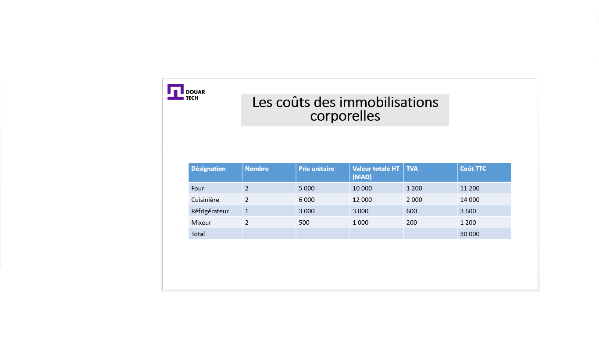
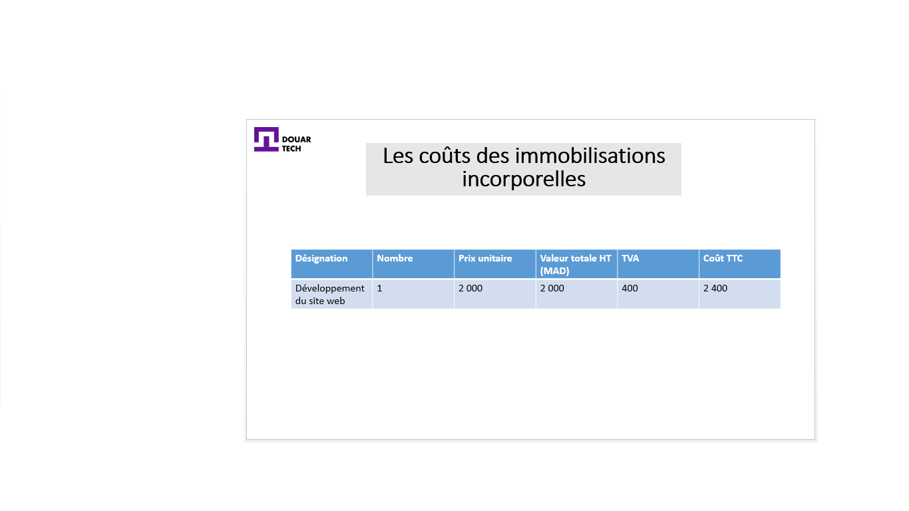

# تحديد رأس المال الأولي

<--!-->

## العناصر الملموسة وغير الملموسة

- أرادت فريدة وصديقتها عايدة إنشاء مشروع مشترك يتمثل نشاطه الرئيسي في إعداد الحلويات المغربية، و بيعها على الإنترنت. لبدء هذا المشروع ، فهما بحاجة إلى بعض الوسائل 

- تنقسم الوسائل إلى عناصر ملموسة و أخرى غير ملموسة

<--!-->

## الأصول غير الملموسة

-  الأصول غير الملموسة: هي المواد غير المجسدة، والتي تحتفظ بها الشركة لمدة تزيد عن سنة واحدة. من بين هذه الأصول الثابتة : الخلفية التجارية ، البرمجيات ، الحق في الإيجار ، براء ات الاختراع ، التراخيص ...

<--!-->

## أصول ثابتة

- الأصول الثابتة الملموسة: تشمل الأصول المجسدة المراد استخدامها بطريقة مستدامة خلال دورة تشغيل المقاولة. نذكر على سبيل المثال في هذه الفئة : الأراضي، المباني، المعدات الصناعية، التجهيزات، معدات النقل والمعدات المكتبية

- خذ مثال على مشروع تحضير الحلويات المغربية، فنحن نقدر الوسائل التي سيحتاجونها كالآتي

<--!-->

<--!-->

<--!-->

## تحديد رأس المال الأولي

- لبدء عملهم ، ستحتاج فريدة وصديقتها عايدة إلى مبلغ (30،000 + 2،400) = 32،400 درهم

- لكن، من الضروري أن يكون لديك احتياطي من المال، للقدرة على التمويل الذاتي وشراء الأحمال التي ستحتاجها التعاونية خلال دورة التشغيل
