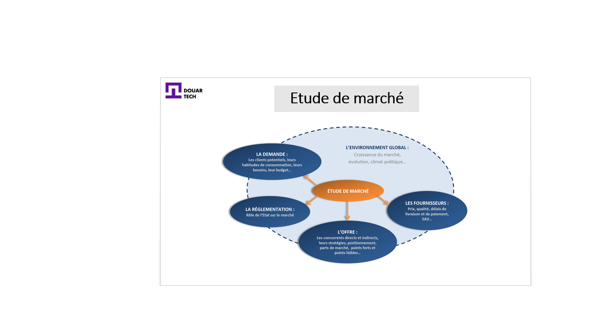

# تحليل السوق

<--!-->

<--!-->

## دراسة السوق

- يجب أن تشمل الدراسة أربعة مواضيع

- 1) السوق: ما هي توجهاته وإمكاناته الرئيسية؟

- 2) الطلب: أي نوع من الزبائن؟ ما هي احتياجاتهم و توقعاتهم ؟

- 3) العرض: أي منافسين؟ هل يمثلون تهديدا؟

- 4) بيئة المشروع: ما هي تطوراته المحتملة التي يمكن أن تعمل بشكل إيجابي أم لا في السوق ؟

<--!-->

## اختبار

- قم بدراسة للسوق وفقًا للمواضيع الأربعة المذكورة

