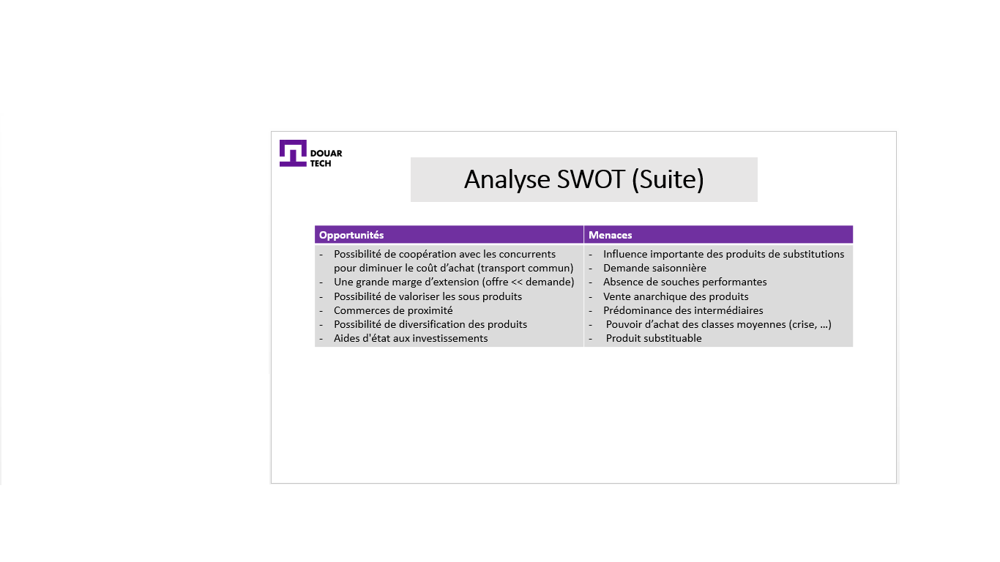

# تصميم إستراتيجية

<--!-->

## تحليل SWOT

- قررت مريم وزوجها أحمد إنشاء مشروعهما الخاص لتوليد الدخل

- فكروا في إنشاء وحدة إنتاج الأرانب. قبل بدء المشروع ، أنشأ مريم وأحمد تشخيصًا استراتيجيًا

<--!-->

<--!-->

<--!-->

## إجراء تحليل تشخيصي

- "سووت" (التهديدات، الفرص، نقاط القوة و نقاط الضعف) هي أداة عملية للغاية خلال مرحلة التشخيص الاستراتيجي

- يمثل ميزة لتجميع نقاط القوة والضعف في الشركة  بالفرص والتهديدات التي تولدها بيئتها

<--!-->

<--!-->

## المحور الداخلي

- نقاط القوة: الموارد المملوكة / أو المهارات التي تمنح ميزة تنافسية

- نقاط الضعف: نقص في عامل نجاح واحد أو حتى عدة عوامل رئيسية أو أمام المنافسين.

<--!-->

## المحور الخارجي

- الفرص: قد تقدم بيئة الأعمال بعض المجالات التي يمكن تطويرها. يجب تحديدها

- التهديدات: يمكن أن يكون لبعض التغييرات الجارية أو القادمة تأثير سلبي على أنشطة الشركة

<--!-->

## التسويق الاستراتيجي

- فيديو توضيحي : https://www.youtube.com/watch?v=y_g-ZP0hmPY

<--!-->

## اختبار

- طبِّق إستراتيجية تسويق لمشروعك
