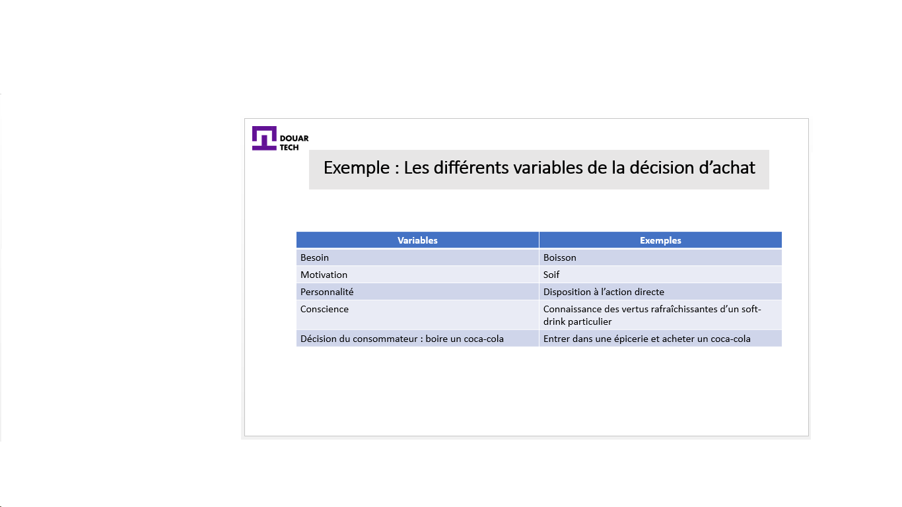
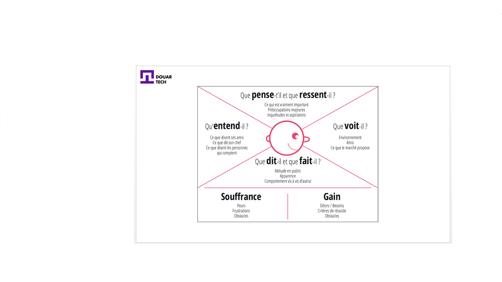

# تعرف على السوق الخاص بك

<--!-->

<--!-->

## العوامل الرئيسية في قرار الشراء

- هناك أربعة متغيرات تؤثر على عملية اتخاذ القرار بالنسبة للمستهلك 

- الاحتياجات: يتوافق مفهوم الحاجة مع المتطلبات الجسدية والنفسية. إنها حالة نقص في وجه شيء مرغوب ومطلوب وضروري لأي سبب من الأسباب

- الدوافع (الحافز): التحفيز يعني أي دافع أو أي شعور بالتحريض على فعل شيء ما أو التصرف بطريقة معينة

- الشخصية : تشمل جميع الخصائص الإنسانية أو السمات الشخصية التي تمثل خصوصية كل فرد. الفرق بين الدوافع والشخصية هو أن: الدوافع تدفع المستهلك إلى التصرف من أجل إرضاء احتياجاته. الشخصية ، من ناحية أخرى ، تعني أن كل مستهلك يتصرف بشكل مختلف لتلبية نفس الحاجة

- الوعي : يمكن تقسيمها إلى ثلاثة متغيرات.

    1) الإدراك: هو التفسير الخاص الذي يعطيه الشخص للأشياء أو حتى الأفكار
    2) التعلم: يشمل أي تغيير في أفكار المستهلك أو ردود أفعاله أو سلوكه العام ؛ سواء كان هذا التغيير نتيجة لممارسة الخبرة أو حتى الحدس
    3) الموقف: يجمع عددًا كبيرًا من المشاعر الفطرية أو وجهات النظر التي تميز السلوك

<--!-->

## تطبيق المزيج التسويقي

- فيديو توضيحي للمزيج التسويقي : https://www.youtube.com/watch?v=u74S3HbBzQc

- مثال عن المزيج التسويقي : https://prezi.com/a7xwvnzwavcz/plan-marketing-mix-bic-stylo/

<--!-->

## بطاقة التعاطف مع العميل

- بطاقة التعاطف هي أداة تمثيل / تصور لما يشعر به العميل الحقيقي أو المحتمل 

- تُستخدم بطاقة التعاطف مع العملاء لفهم المشاعر والعواطف التي قد يشعر بها العميل في إطار مسار العميل

<--!-->

<--!-->

## خلق شخصية

- يمكن أن تكون الشخصية التي تم إنشاؤها لتطوير خط جديد من الملابس الكلاسيكية على سبيل المثال

سعاد
40 سنة
2 أطفال
مجال حضري
إطار عالي
تتبع الموضة عن كثب
إلخ

<--!-->

- الشخصية في مجال التسويق هي شخصية خيالية تمثل مجموعة أو شريحة مستهدفة في سياق تطوير منتج أو خدمة جديدة أو نشاط تسويقي 

- تُعطى للشخصية بشكل عام الاسم الأول والخصائص الاجتماعية والنفسية 

- يمكن استخدام العديد من الأشخاص في نفس مشروع التطوير 

<--!-->

## اختبار

- طبق المزيج التسويقي على فكرة مشروعك 

- قم بإنشاء شخصية لمشروعك

