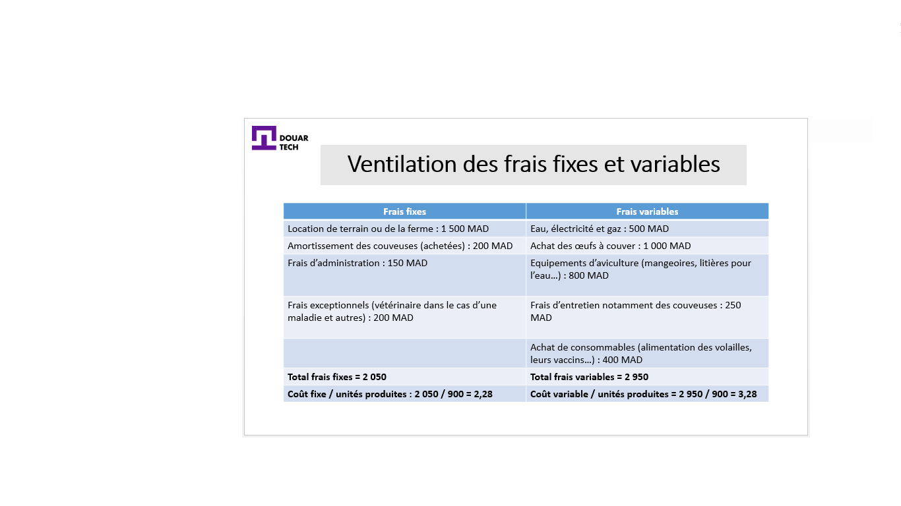

# حساب عتبة الربح و نقطة التعادل

<--!-->

## التكاليف الثابتة / التكاليف المتغيرة

- أي عمل مهما كان نشاطه يتكبد تكاليف ثابتة وتكاليف متغيرة

- لنأخذ على سبيل المثال شركة تربية الدواجن: "دواجن دكالة" ، وهي شركة لتربية دجاج المزرعة وأنواع أخرى من الدواجن (السمان ، البط ، ...)

- تتكبد هذه الشركة تكاليف ثابتة مثل إيجار المباني العاملة والتكاليف الإدارية واستهلاك الحاضنات والآلات الأخرى

- ومع ذلك ، تختلف الرسوم المتغيرة اعتمادًا على النشاط. كلما زاد إنتاجنا بكميات كبيرة ، زادت أهمية هذه التكاليف 

- في المثال السالف الذكر، يبدأ المالك بكمية نشاط تبلغ 1000 بيضة تفقيس يجب وضعها في الحاضنات لمدة 21 يومًا من أجل الحصول على كتكوت سيصبح دجاج مزرعة بعد عدد معين من الأيام

- بالطبع ، تحتاج هذه الحاضنات إلى الكهرباء ، وتكاليف الصيانة ، إلخ. و ذلك على حسب سعتها: مثلا حاضنة 300 بيضة لا تستهلك الكثير من الكهرباء مثل  حاضنة 1000 بيضة ، نفس الشيء بالنسبة لرسوم الصيانة

- إضافة إلى ذلك ، يختلف عدد بيض التفقيس الذي يعتبر هنا مادة خام، حسب حجم النشاط التجاري وبالتالي فإن تكلفته هي واحدة من التكاليف المتغيرة

<--!-->

## حساب التكاليف الثابتة

إنشاء قائمة بجميع التكاليف على مدى فترة من الزمن

افصل بين التكاليف الثابتة والتكاليف الهامشية أو المتغيرة

راقب التكاليف الثابتة التي يتم تجاهلها بشكل عام

قم بقسمة التكلفة الثابتة على إجمالي الوحدات المنتجة

افهم كيف يمكنك تخفيض التكاليف الثابتة

<--!-->

## حساب التكاليف المتغيرة

- صنف التكاليف المتغيرة

- اجمع كل التكاليف المتغيرة لفترة معينة

- قم بقسمة المبلغ الإجمالي للتكاليف المتغيرة على حجم الإنتاج

<--!-->

## تحديد التكاليف الثابتة والمتغيرة

- بالنسبة لشركة دواجن دكالة يتم تسجيل التكاليف التالية لشهر يوليوز

- إيجار أرض أو مزرعة: 2،000 درهم
- المياه والكهرباء والغاز: 500 درهم
- شراء بيض التفقيس: 1،000 درهم
- إطفاء الحاضنات (200 درهم) (التخصيص الشهري)
- معدات الاستزراع (مغذيات ، فضلات للمياه ، الخ): 2،000 درهم
- تكاليف الصيانة بما فى ذلك الحاضنات 250 درهم
- رسوم إدارية: 250 درهم
- شراء المواد الاستهلاكية (أعلاف الدواجن ولقاحاتها ...): 300 درهم
- تكاليف استثنائية (طبيب بيطري في حالة مرض وآخر): 300 درهم

<--!-->

## توزيع التكاليف الثابتة والمتغيرة

<--!-->

## أنواع الرسوم المختلفة

- ترتبط التكاليف المباشرة ارتباطًا مباشرًا بنشاط أو منتج ، ومن ثم يمكن دمجها مباشرةً في حساب التكلفة 

- التكاليف غير المباشرة: لا تتعلق مباشرة بنشاط تجاري أو منتج  

- أمثلة على الرسوم المباشرة: المواد الخام واليد العاملة المباشرة

- أمثلة على الرسوم غير المباشرة: استهلاك المعدات المستخدمة لتصنيع جميع أنواع المنتجات والإيجار والكهرباء والمياه في المحل الذي يتم فيه إنتاج العديد من المنتجات

<--!-->

## حساب التكلفة

- سعر التكلفة = مجموع التكاليف المباشرة وغير المباشرة / الكميات المنتجة أو الخدمات

- يتوافق سعر التكلفة (أو تكلفة الوحدة) مع مجموع جميع التكاليف المباشرة وغير المباشرة التي تتحملها الشركة لإنتاج سلعة أو تقديم خدمة ، بناءً على كمية السلع المنتجة أو الخدمات المقدمة

- في مثال دواجن دكالة 

- سعر تكلفة دجاج المزرعة المباعة = (تكلفة بيض التفقيس (السعر + تكاليف النقل + التغليف وتكاليف التوريد الأخرى) + اليد العاملة المباشرة + إطفاء الحاضنات + الماء + الكهرباء + الغاز + إيجار المحل الذي يتم فيه إنتاج الدجاج) / الكميات المنتجة

<--!-->

## حساب سعر البيع

- سعر بيع الوحدة = (سعر تكلفة الوحدة + الهامش الإجمالي للوحدة) × (1 + معدل ضريبة القيمة المضافة)

- مثال

- تنتج شركتك 500 صحن بتكلفة 10 دراهم دون احتساب الرسوم للوحدة (على سبيل التذكير ، يشمل سعر التكلفة عمليات الشراء والتوريد والإنتاج والتوزيع والتكاليف الإدارية المتعلقة بإنتاج الصحن) 

- إذا قدرت أنك بحاجة إلى 250 درهمًا للرسوم الاستثنائية والنتيجة ؛
سيكون سعر بيع وحدتك (10 درهم + 250/500) × 1.2 = أو 12.6 درهما مع احتساب الرسوم

<--!-->

## حساب عتبة الربح و نقطة التعادل

- بدأت "دواجن دكالة" نشاطها في 01/01/2019 ، وتستغرق الحضانة أو الحضانة الصناعية 21 يومًا ، إذن في 22/01/2019 ولدت الدفعة الأولى من الدجاج

- مع حجم نشاط يبلغ 1000 بيضة ، ازداد 600 فرخ فقط (معدل فشل بنسبة 40 ٪ لعدم إتقان المهنة بعد)

- على مر الأشهر ، عرف المزارع حيثيات المهنة، بذلك تجنب بعض الخسائر وتمكن من تحسين سلسلة إنتاجه ، مما عرف انخفاض معدل الفشل الذي أصبح 10 ٪ بعد الأشهر الثلاثة الأولى 

- بعد أن لوحظ عجز في الشهر الأول والثاني ، لم تلاحظ الشركة أي خسارة أو ربح في شهرها الثالث ، لذلك فهي وصلت إلى عتبة الربح

- تم الوصول إذن إلى نقطة التعادل بعد ثلاثة أشهر من تاريخ الإنشاء، أي 01/04/2019

- عتبة الربح تعني أن المقاولة لا تحقق لا ربحا و لا خسارة

- نقطة التعادل هي التاريخ الذي تصل فيه المقاولة إلى عتبة الربح

<--!-->

## اختبار

- قم بحساب عتبة الربح و نقطة التعادل لمشروعك الخاص : https://sites.google.com/site/comptaecritures/calculs-commerciaux-et-financiers/comment-calculer-le-seuil-de-rentabilite-et-le-point-mort
