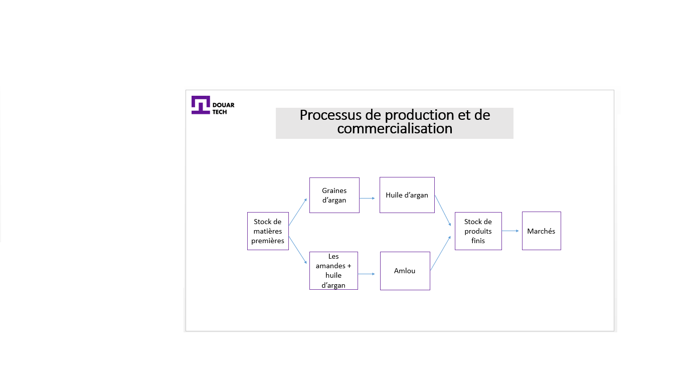
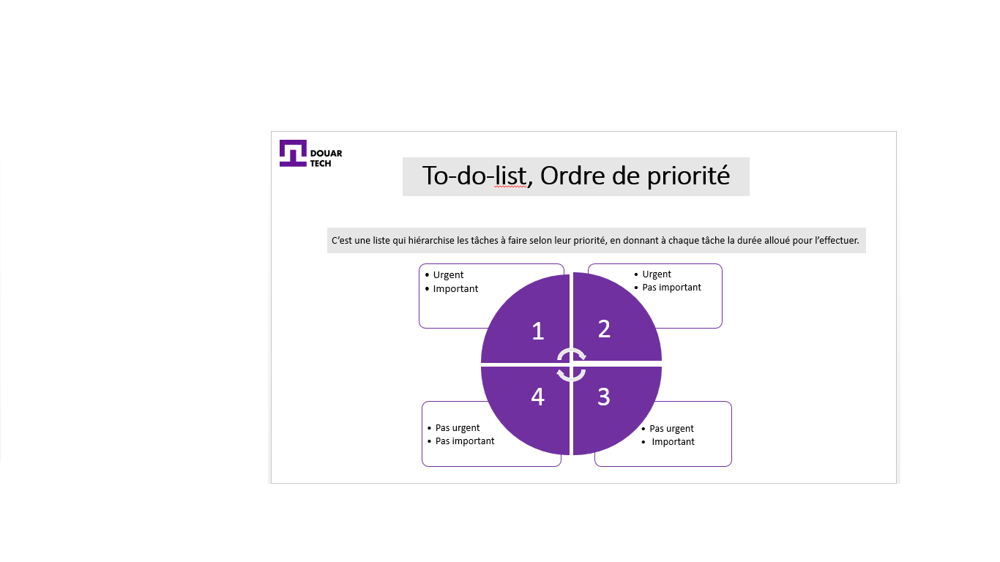

# ضع خطة عمل

<--!-->

## مثال

- قررت البتول الشروع في مشروع لتصنيع مستحضرات التجميل المنصوعة من النباتات والمكونات الطبيعية الأخرى ، و أسمت تعاونيتها بٱسم "زينة أبلدي" 

-  قبل الخوض في مفهوم خطة العمل ، يبدو من الحكمة التفكير في مفهوم أوسع يشمل خطة العمل ألا و هو استراتيجية الشركة

- وجدير بالذكر أن مفهوم الاستراتيجية مرتبط ارتباطًا وثيقًا بمفاهيم الرؤية والمهمة

<--!-->

## المهمات

-  لدى البتول وشريكتها فاطمة رؤية ، ألا جعل التعاونية معيارًا في مستحضرات التجميل الطبيعية ، أن تكون رائدة في منطقتهما وأن تستهدف الأراضي المغربية بأكملها في السنوات الخمس المقبلة

- لهذا ، تم وضع المهمات على النحو التالي:

-جعل كل امرأة أكثر جمالا ، بفضل المكونات الطبيعية الوطنية، وذات جودة عالية وبسعر مناسب ، هذه هي مهنة التعاونية
-صناعة مستحضرات تجميل 100٪ عضوية و 100٪ صنعت في المغرب بيد عاملة مغربية ، ومخصصة لأي امرأة مغربية مهتمة بجمالها ، هذه هي مهمة التعاونية

<--!-->

## من القيم إلى خطة العمل

- من المفيد تذكر الدورة التي تربط القيم والرؤية بخطة العمل ، وهي على النحو التالي:

- القيم هي المبادئ التي تحرك كل شركة ، وهي خاصة بها ، في حالتنا ، فإن قيم "زينة أبلدي" هي: الطبيعة، الجمال للجميع، الامتياز وأسبقية المكونات المحلية ...

- تحدد هذه القيم مع الرؤية (المذكورة أعلاه) المهام التي يتعين إنجازها ، والتي بدورها تجعل من الممكن تحديد الأهداف طويلة المدى ، ثم على المدى المتوسط والقصير في إطار استراتيجية الشركة ، يتم وضع هذه الاستراتيجية كخطة عمل ، هذا الأخير هو الوثيقة التي تصف جميع الخطوات اللازمة لتحقيق هذه الأهداف

<--!-->

<--!-->

## الخمس واوات

1)من: من؟ لمن؟ مع من؟ من خلال هذا السؤال نحدد الشركاء المختلفين

- من أطلق المشروع: البتول وفاطمة
- لمن (المقصود): أي امرأة تعتني بجمالها (وتستخدم منتجات طبيعية) سواء في المناطق  القروية أو الحضرية
- مع من: مختلف مقدمي الخدمات ، أي الموردين (المزارعون وغيرهم من بائعي المنتجات الطبيعية في منطقتهم القروية) والموظفين (النساء أعضاء  التعاونية)

<--!-->

2) ماذا: أنشطة المشروع

الأنشطة الرئيسية لهذا المشروع: 
- التصنيع والعمل اليدوي: يتكون من استخراج الزيوت الطبيعية وتصنيع مستحضرات التجميل القائمة على المكونات الطبيعية وتغليفها وتعبئتها
- أعمال التسويق: بيع هذه المنتجات للنساء في منطقتهن ، ولكن أيضًا استهداف النساء الحضريات من خلال المشاركة في المنتديات والمعارض في منصة مخصصة للتعاونية

<--!-->

3) : الأهداف ومصالح الجهات الفاعلة؟

- الهدف الأساسي هو إنشاء شعار أو علامة تجارية لمستحضرات التجميل في قريتهم ، ولكن أيضًا لاستغلال المنتجات المحلية من خلال إنشاء علامة تجارية عضوية بنسبة 100٪
- ترتبط هذه الأهداف المنشودة ارتباطًا وثيقًا بالرؤية العامة للشركة

<--!-->

4) إلى أين؟ : حالة الفاعلين

- الفاعلان الرئيسيان هما البتول وفاطمة ، وهما امرأتان من منطقة قروية، طموحتان وتناضلان من أجل ريادة الأعمال النسائية ، في حين لديهما ميل إلى مستحضرات التجميل "العضوية"

<--!-->

 5) متى؟ : متى ؟ المدى القصير والمتوسط والبعيد

- تهدف التعاونية على المدى القصير السوق القروية فقط (المرأة القروية المحلية)

- على المدى المتوسط: كما تستهدف المرأة في المناطق الحضرية من خلال المشاركة في المنتديات والمعارض

- على المدى الطويل: تنوي التصدير دولياً

<--!-->

## قائمة المهام

- لدى البتول وفاطمة الكثير من المهام للقيام بها (بين التموين، الإشراف على الفريق، التسويق ...)

- لهذا ، من المهم جدا التنظيم ! 

-ومن هنا تأتي أهمية "قائمة المهام"

<--!-->

<--!-->

## 3) مثال على قائمة مهام الباتول

- 9:00 حتى 10:00 لقاء مع فاطمة وأعضاء الفريق حول عملية الإنتاج

- 10:00 حتى 11:00 العصف الذهني مع فاطمة على استعمال عبوة جديدة

- 11:00 حتى 11:30 صباحًا استلام الدفعة الجديدة من المواد الخام (من مورد)

<--!-->

- ...... و هكذا! إلى أن ننهي قائمة المهام

- إنها طريقة فعالة لتحديد الأولويات وتذكر ما يجب القيام به ، وإدارة الوقت

<--!-->

## ما يجب القيام به ل "قائمة مهام" فعالة

1) إن تقسيم كل مشروع رئيسي إلى مهام صغيرة ، وتقسيم المهام إلى عدة إجراأت صغيرة يتجنب الشعور بالإحباط أمام حجم المهمة ويحفز على المزيد

<--!-->

2) مع وجود هدف رئيسي وأهداف ثانوية لكل قائمة مهام يومية ، فإن الهدف الرئيسي هو هدف ذو أولوية يجب تحقيقه على الإطلاق ، إلى جانب وجود مهام فرعية

معظم المهام ثانوية ولا تتطلب قدرًا كبيرًا من الوقت ، وبالتالي تطبيق قانون باريتو ، المهمة الرئيسية منطقيًا لها أكبر الأثر (80 ٪ تأثير) والمهام الثانوية على الرغم من كثرتها تأثيرها 20٪ فقط

<--!-->

3)ابدأ اليوم بأصعب المهام والتي تحتاج إلى تركيز أكبر

- بداية اليوم هو أكثر ملاءمة للمهام الصعبة، في حين أن نهاية اليوم مناسب للمهام البسيطة

<--!-->

4) كن واقعيا وتنبأ بما لا يمكن التنبؤ به

- لأنه لا يوجد شيء أكثر إحباطًا من إنهاء يوم بقائمة مهام نصف منتهية. لا تفرط في ملئ "قوائم المهام" لأن 30٪ من وقتك مخصص لما هو غير متوقع

<--!-->

## ما لا يجب القيام به ل "قائمة مهام" فعالة

- 1) أحد الأخطاء التي يجب تجنبها هو إنشاء قائمة مهام واحدة تجمع بين ما هو مهني وما هو شخصي في نفس الوقت ، يجب عليك فصل الاثنين

- بالإضافة إلى ذلك ، تتطلب المهام الشخصية جهودًا مختلفة تمامًا عن المهام المهنية

<--!-->

2) الرغبة في فعل الكثير: تدوين الكثير من المهام معتقدًا أنك ستتمكن من القيام بكل شيء في يوم واحد يعد خطأ. حتى إذا كنت فعالاً في العمل ، فلا يجب أن تبالغ في تقدير نفسك

-  القائمة الطويلة جدًا هي الإحباط المضمون في نهاية اليوم

<--!-->

3) تجاهل مدة المهام

- لتنظيم قائمة المهام والتأكد من الانتهاء منها قبل نهاية اليوم ، يجب أن تأخذ في الاعتبار مدة المهام المختلفة

- إنها طريقة رائعة لإدارة الوقت ، وستتجنب الكتابة كثيرًا في القائمة

<--!-->

4) عدم مراعاة الشق البصري

- قائمة مهام واضحة ومرتبة بشكل جيد توفر الوقت

- يمكنك أن ترى في لمحة تقدم جميع المهام : العاجلة ، القادمة ، تلك التي تم إنجازها، وما إلى ذلك

<--!-->

## اختبار

- أنجر "قائمة مهام" ليوم عادي في العمل

- مع تصنيف المهام حسب ترتيب أهميتها وأولويتها

