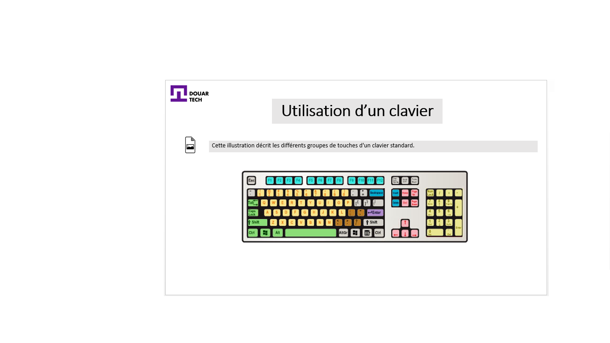
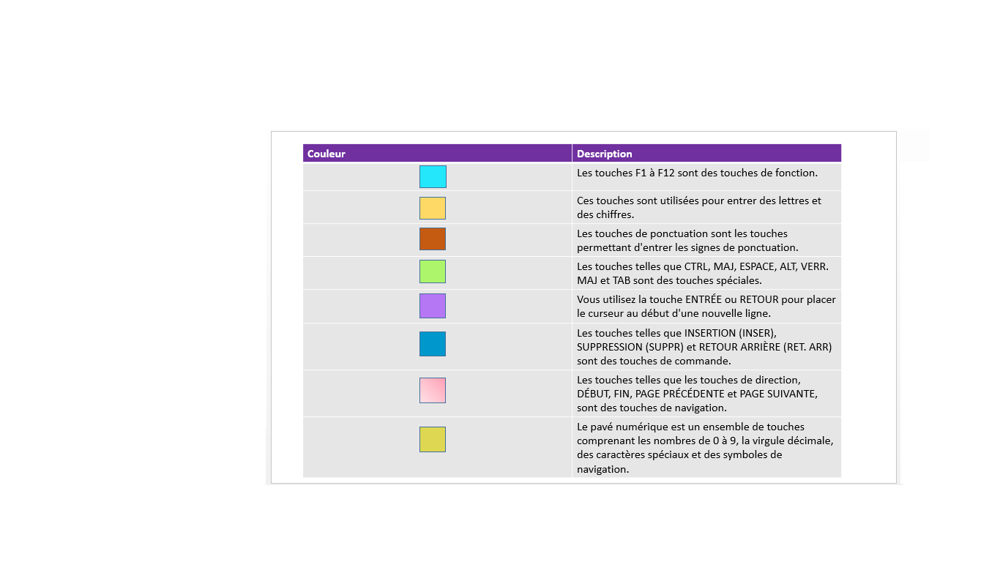

# Notions de base en informatique

<--!-->

## Introduction

- Aujourd'hui, savoir utiliser un ordinateur est l'une des compétences de base nécessaires pour réussir professionnellement. 

- Ce module explique le rôle des ordinateurs et les concepts de base liés à leurs différents composants. 

- Ce module décrit également l'utilisation d'un ordinateur dans différents aspects de la vie courante.

<--!-->

## Inttroduction aux ordinateurs

- Un ordinateur est un appareil électronique utilisé pour stocker et traiter des informations. 

- Les ordinateurs permettent d'effectuer diverses tâches telles que :

-La réception et l'envoi de messages à des proches, 
-La création de présentations et la gestion d'enregistrements. 
-Dans  les domaines de l'enseignement et de la recherche : diffuser des nouvelles, faire des prévisions météorologiques, ainsi que pour de nombreuses autres activités professionnelles et de loisirs. 

- Les ordinateurs peuvent vous faire économiser du temps, des efforts et de l'argent.

<--!-->

## Le rôle des ordinateurs

- Les ordinateurs jouent un rôle majeur dans nos vies quotidiennes. 

- Ils sont utilisés dans des endroits aussi divers que les entreprises, les établissements scolaires, les administrations et les commerces. 

<--!-->

## Les différents domaines de l’utilisation des ordinateurs

- Education

- Commerce et finances personnelles

- Soins médicaux

- Recherche scientifique

- Affaires du gouvernement

- Arts et loisirs

- Edition

<--!-->

## Composants d’un ordinateur

- Un ordinateur est constitué de différents composants, dont chacun effectue une fonction spécifique.

- Périphériques d’entrée : Vous utilisez des périphériques d'entrée pour fournir des informations à un ordinateur.

- Par exemple pour taper une lettre ou pour donner des instructions à un ordinateur afin qu'il effectue une tâche spécifique.

<--!-->

## Périphériques d’entrée

- Souris

- Clavier

- Microphone

- Scanneur

<--!-->

## Périphériques de sortie

- Périphériques de sortie :  Vous utilisez des périphériques de sortie pour obtenir le résultat d'une tâche effectuée par l'ordinateur. 

- Imprimante

- Haut-parleurs / Casque

<--!-->

Unité centrale de traitement et mémoire informatique : 

- L'unité centrale (UC) est un appareil qui interprète et exécute les commandes que vous donnez à un ordinateur. Il s'agit de l'unité de contrôle de l'ordinateur. L'UC est également connue sous le nom de processeur.

- La mémoire est l'emplacement où les informations sont stockées et récupérées par l'UC. Il existe trois principaux types de mémoire.

<--!-->

## Mémoire informatique

- Mémoire vive (RAM) : C'est la mémoire principale, qui vous permet de stocker temporairement des commandes et des données. L'UC lit les données et les commandes de la RAM pour effectuer des tâches spécifiques. La RAM est volatile, ce qui signifie qu'elle est disponible uniquement lorsque l'ordinateur est allumé. Le contenu de la RAM doit être copié vers un dispositif de stockage si vous souhaitez enregistrer les données de la RAM.

- Mémoire morte (ROM) : Cette mémoire conserve son contenu même après l'arrêt de l'ordinateur. La ROM est une mémoire non volatile, ou permanente, communément utilisée pour stocker des commandes, par exemple les commandes qui vérifient que tout fonctionne correctement.

- Mémoire flash : Cette mémoire non volatile conserve les données même après l'arrêt de l'ordinateur. Contrairement à la ROM, elle permet d'effacer ou de modifier les informations stockées.

<--!-->

<--!-->

- Cartes d’extension : Une carte d'extension est une carte de circuits imprimés qui peut être connectée à une carte mère pour ajouter à votre ordinateur des fonctionnalités telles que l'affichage vidéo et les capacités audio. 

- Une carte d'extension améliore les performances de votre ordinateur et étend ses fonctionnalités. 

<--!-->

## Cartes d'extension

- Carte vidéo

- Carte d'interface réseau (NIC)

- Carte son

<--!-->

- Dispositifs de stockage : Les dispositifs de stockage sont utilisés pour stocker des informations de l'ordinateur. Il existe de nombreux types de dispositifs de stockage : lecteur ou disque dur, CD-ROM, ou DVD-ROM, ou Cloud par exemple.

- Les dispositifs de stockage peuvent être divisés en deux types, les dispositifs de stockage internes et les dispositifs de stockage externes.

<--!-->

## Dispositifs de stockage

- Disque dur

- CD-ROM

- DVD-ROM

- Cloud

<--!-->

- Ports et connexions : Un port est un canal par lequel les données sont transférées entre des périphériques d'entrée/de sortie et le processeur. 

- Il existe plusieurs types de ports que vous pouvez utiliser pour connecter l'ordinateur aux appareils externes et aux réseaux. 

<--!-->

## Ports et connexions

- Port USB : Utilisez ce type de port pour connecter des périphériques tels qu'une souris, un modem, un clavier ou une imprimante à un ordinateur.

- FireWire : Utilisez ce port pour connecter des appareils tels qu'un appareil photo numérique. La connexion est plus rapide qu'une connexion USB.

- Port réseau : Utilisez ce port pour connecter un ordinateur à d'autres ordinateurs afin d'échanger des informations.

- Port parallèle et port série : Utilisez ces ports pour connecter des imprimantes et d'autres appareils à un ordinateur personnel. Toutefois, le port USB est aujourd'hui privilégié pour connecter des périphériques, parce qu'il est plus rapide et plus facile à utiliser.

- Carte vidéo : Connectez un écran à la carte vidéo sur votre ordinateur. La carte vidéo génère le signal vidéo reçu de l'ordinateur et l'envoie à l'écran par l'intermédiaire d'un câble. La carte vidéo peut être sur la carte mère ou sur une carte d'extension.

- Alimentation : La carte mère et d'autres composants d'un ordinateur utilisent un courant continu. Le bloc d'alimentation convertit le courant alternatif d'une prise murale en courant continu.

<--!-->

## Utilisation d'un ordinateur

- Vue d’ensemble d’un clavier : Le clavier est un périphérique d'entrée que vous utilisez pour entrer des commandes ou du texte dans un ordinateur. 

- Certains claviers peuvent avoir des dispositions de touches différentes.

<--!-->

<--!-->

<--!-->

## Utilisation d'une souris

- Une souris est un petit périphérique que vous pouvez utiliser pour déplacer, sélectionner et ouvrir les éléments affichés sur votre écran d'ordinateur.

- La souris a deux boutons, gauche et droit :

- Vous effectuez la plupart des actions en cliquant avec le bouton gauche

- Le bouton droit sert à des fonctions spécifiques

<--!-->

## Qu’est ce qu’un système d’exploitation ?

- En plus du matériel, un ordinateur a besoin de logiciels pour fonctionner. 

- Les logiciels envoient des instructions au matériel pour effectuer les tâches nécessaires.

- Le logiciel le plus important de l'ordinateur est le système d'exploitation, qui gère et contrôle le matériel connecté à votre ordinateur. 

- Le système d'exploitation fournit une interface qui vous permet d'interagir avec l'ordinateur. 

- Un système d'exploitation doté d'une interface graphique utilisateur vous offre une interface facile à utiliser pour installer du matériel ou des logiciels. 

- Vous devez mettre régulièrement à jour votre système d'exploitation pour qu'il reste compatible avec le nouveau matériel que vous installez.

<--!-->

## Test

- En quoi un ordinateur peut-être utile pour vous ?

- Citez les composants de l’ordinateur dont vous vous rappelez et le rôle de chacun.
