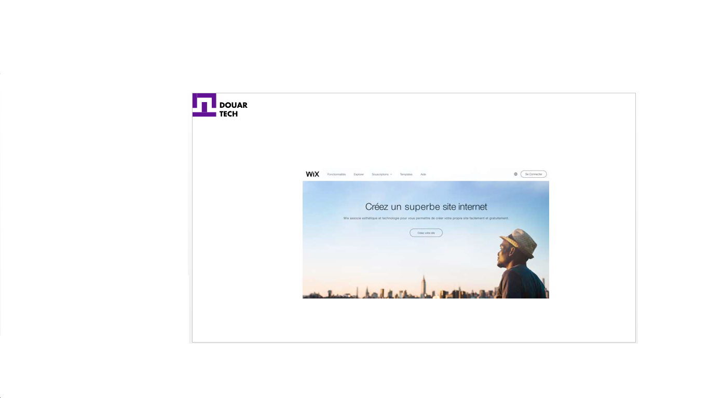

# Concevoir un site web par Wix

<--!-->

## Qu’est ce que Wix ?

- Wix.com est une plateforme de développement Web basée sur le Cloud qui réunit des millions d’utilisateurs à travers le monde.  

- Wix permet à chacun de créer facilement un site web de qualité professionnelle.

<--!-->

## Comment créer un site sur Wix ?

- Vous devez en premier accéder à la plateforme WIX, soit vous recherchez sur un moteur de recherche, soit vous tapez directement l’adresse du site https://fr.wix.com sur votre champ de navigation. 

- L’interface qui suit va donc apparaitre sur votre écran.

<--!-->

<--!-->

## Comment créer un site sur Wix ?

- Il faut par la suite cliquer sur le bouton « créer votre site web ».

- Vu que vous êtes encore nouveau sur la plateforme, il est important de se créer un compte d’utilisateur. Il suffira d’entrer votre adresse mail ainsi que votre mot de passe. 

- Sachez que la conception se fait directement en ligne, il n’y a donc aucun fichier ni application à télécharger sur votre ordinateur.

<--!-->

- Une nouvelle interface apparait et vous présente différentes options. 

- Sur ces options, vous pouvez sélectionner à quoi servira votre site, soit pour un blog, une boutique en ligne, portfolio pour photographe, cv et site personnel… Vous avez le choix ! 

- Mais si vous êtes encore indécis sur la nature de votre futur site web, vous pouvez sélectionner « Autre ».

<--!-->

- De ce fait, vous arrivez sur un catalogue virtuel qui vous propose divers canevas ou modèle de site aussi appelé des Templates.

- Ces derniers sont déjà préétabli, il ne vous suffira que de choisir le modèle qui vous correspond et répond à vos envies.

- Ces Templates peuvent être modifiés par l’utilisateur lui-même selon la future fonction du site créé.

<--!-->

<--!-->

- Sélectionnez le Template que vous souhaitez transformer. Cliquez dessus et sélectionnez le bouton « modifier ».

- Il s’agit d’un site préétabli, si certaines images ne correspondent pas à ce dont vous recherchez pour votre site, il faut noter que ces images peuvent être remplacées.

<--!-->

<--!-->

- À cet égard, il suffit de cliquer sur le bouton « Arrière-plan » en haut sur votre gauche.

- Vous avez des propositions d’image d’arrière-plan au choix, mais vous pouvez également choisir des photos dans votre album sur votre disque dur. 

<--!-->

- Vous avez deux options qui s’offrent à vous : 

- La première permet d’avoir un arrière-plan identique sur toutes les pages de votre site web. 
- La seconde permet de définir différents arrière-plans pour chacun de vos pages.

<--!-->

- Par la suite, vous pouvez modifier les textes sur votre site, en cliquant directement dessus.

- Avec un traitement de texte basique, les textes peuvent être changés. Il est aussi possible de déplacer ces textes ou de les agrandir.

<--!-->

- Les différentes pages de votre site sont également déjà préétablies, il ne vous suffira que de les renommer. 

- Pour cela, vous devez cliquer sur le bouton « Page Home ». La structure de votre site apparait par la suite. Vous pouvez y voir les différentes rubriques de votre site dont la « page d’accueil », « à propos de nous », « blog »…

<--!-->

-  Le nombre de rubriques qui apparait dépend du Template que vous avez sélectionné au début. Au fur et à mesure, vous verrez que les onglets que vous avez renommés apparaissent petit à petit sur votre site.

- Avant de terminer toutes vos modifications, n’oubliez surtout pas de cliquer sur le bouton « sauvegarder ». Ce dernier se situe en haut à votre droite.

<--!-->

- Vous obtiendrez alors une adresse. Lorsque cette fenêtre apparaitra, il vous suffira de taper le nom de votre site. Vous devez ensuite sauvegarder et continuer.

- Pour terminer la création de votre site, il vous suffit de sélectionner le bouton « publier » et voilà.

<--!-->

## Test

- Choisissez un projet entrepreneurial, et élaborez un site web sur Wix pour ce projet.

- Il est possible de travailler en petit groupe.

