# Notre plateforme

<--!-->

## Douar tech

L’Association Douar Tech a pour objectif de promouvoir l'indépendance économique des jeunes issus de milieux précaires à travers une formation en entrepreneuriat et en développement informatique. 
Notre mission est de responsabiliser et de promouvoir l’autonomie socio-économique et financière de ces jeunes. Cela devient possible en acquérant des compétences pour accéder à un emploi bien déterminé ou pour devenir des entrepreneurs et des dirigeants de PME.
Nous facilitons cet objectif grâce à un contenu de haute qualité, pertinent et engageant sous diverses formes. Plus précisément, nous utilisons un modèle d’apprentissage mixte en combinant l’enseignement en personne, le mentorat personnalisé et les opportunités d’apprentissage en ligne grâce à une plateforme d’e-learning multilingue créée pour rendre le contenu accessible hors ligne pour nos étudiants et collaborateurs.

<--!-->

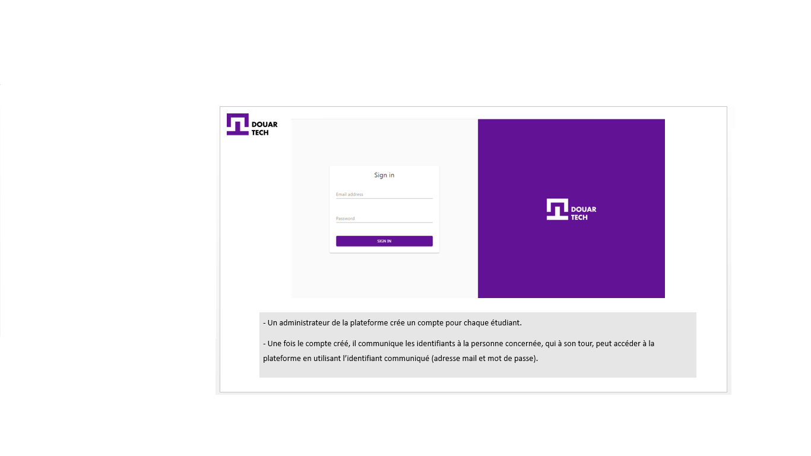

<--!-->

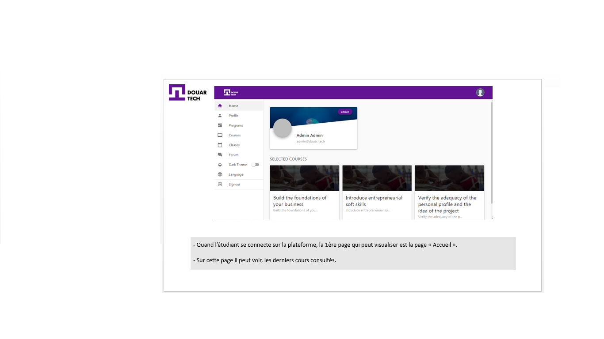

<--!-->

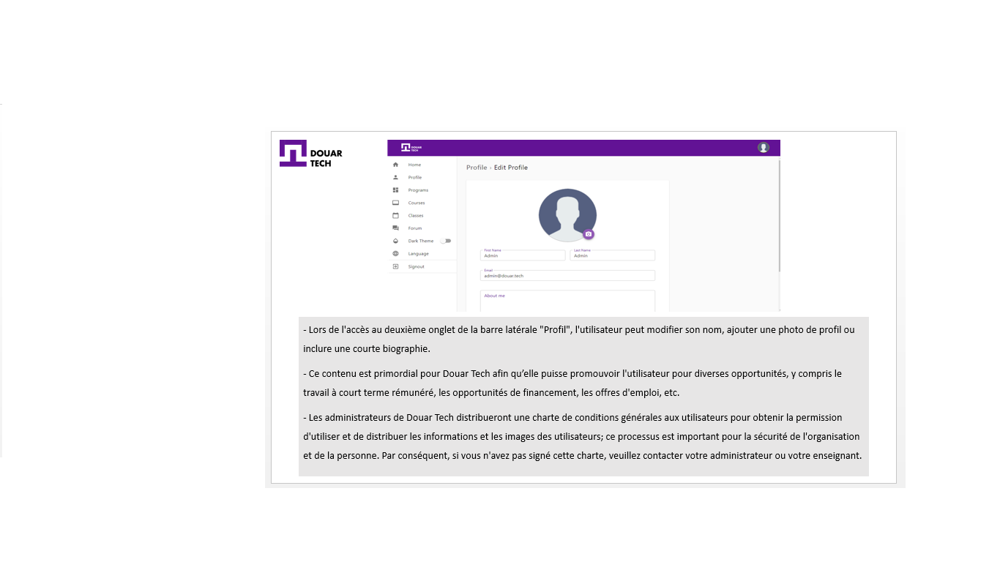

<--!-->

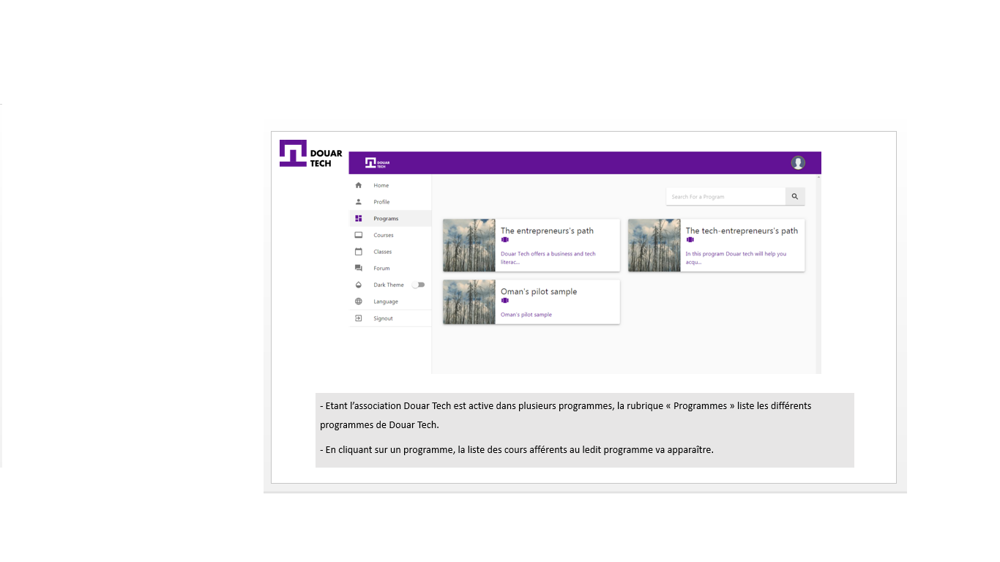

<--!-->

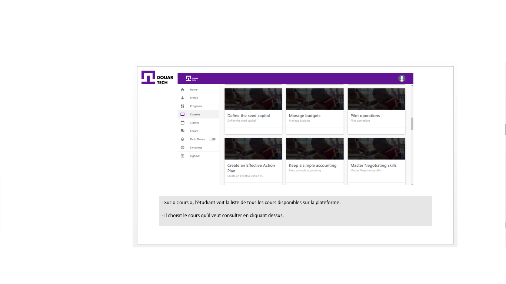

<--!-->

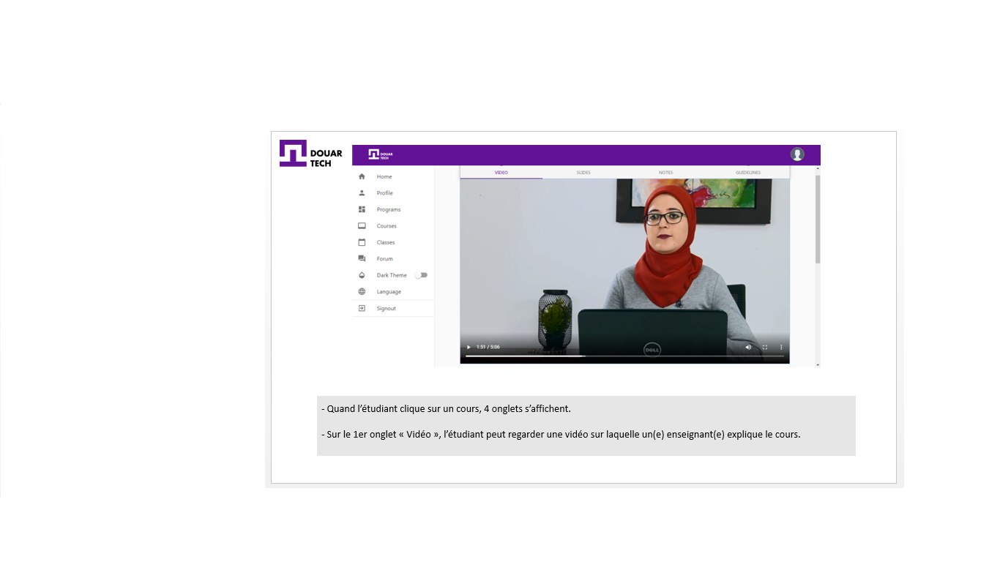

<--!-->

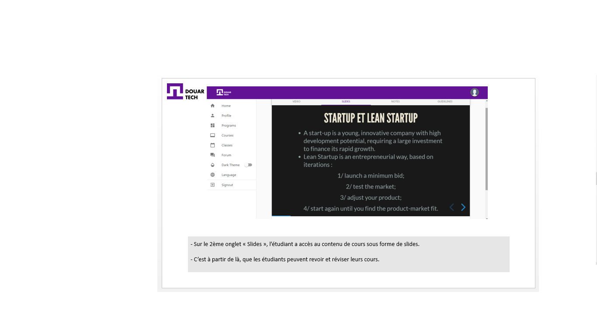

<--!-->

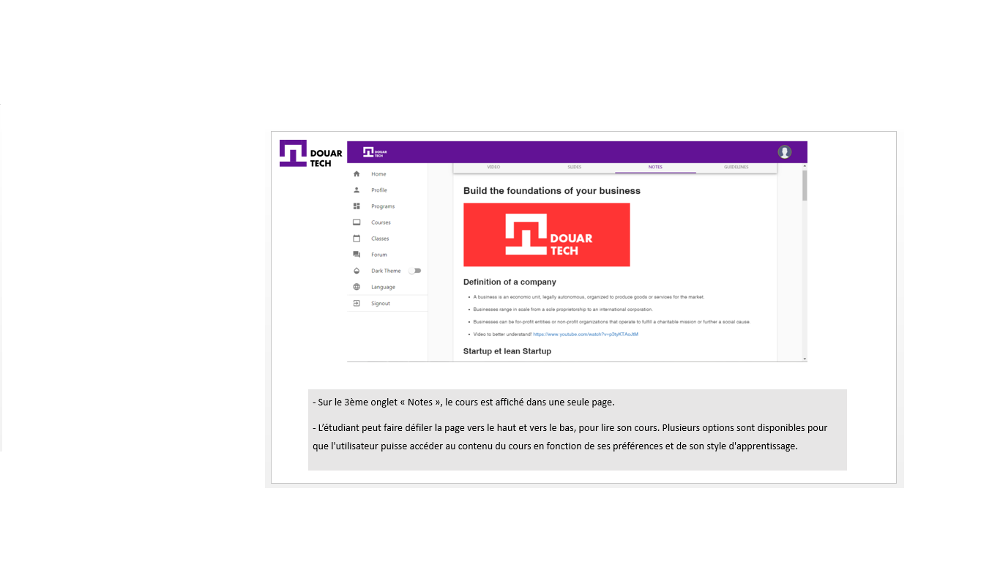

<--!-->

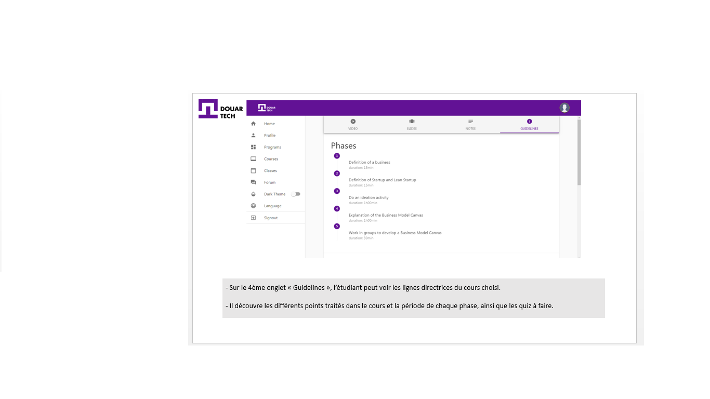

<--!-->

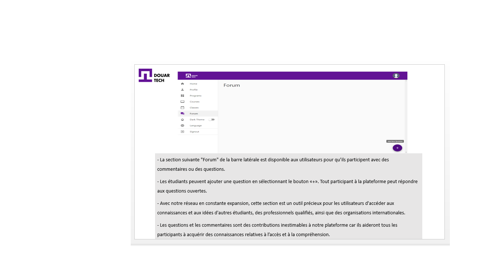

<--!-->

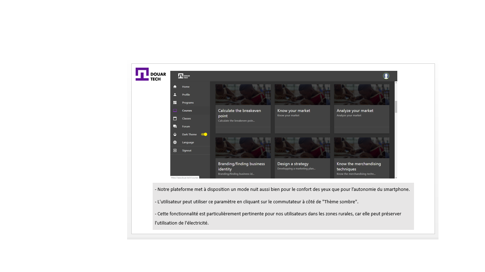

<--!-->

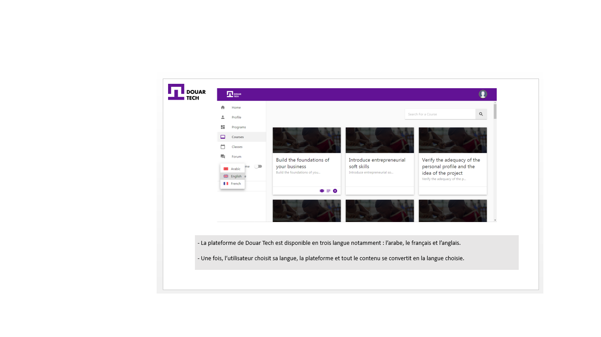

<--!-->

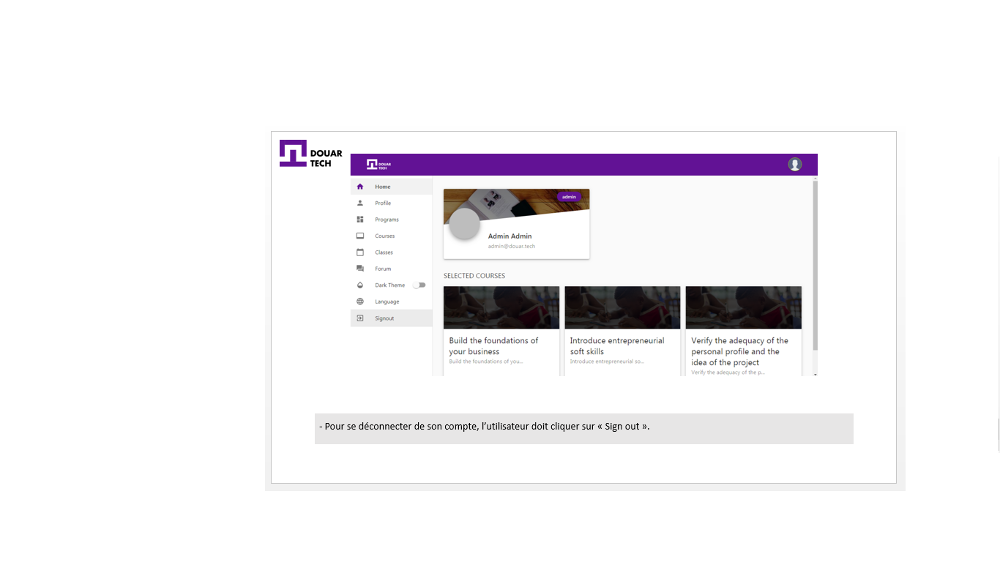

